# 01 — VM Setup

This section covers the initial setup of all virtual machines in Hyper-V, including static IP assignment, renaming, and domain joining for both client PCs.

---

## Hyper-V

### Hyper-V Manager

All VMs created and running inside Microsoft Hyper-V on HALLOWPC (Windows 11 host).

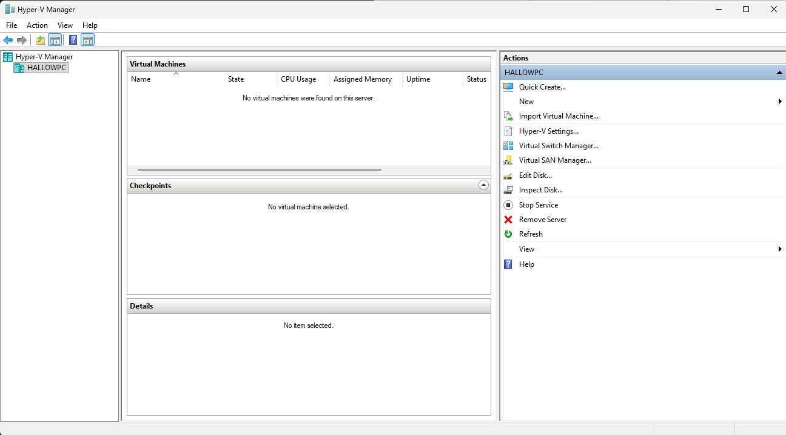

### Virtual Switch

Internal virtual switch (LabSwitch) created to isolate all lab traffic on the 192.168.10.0/24 network.

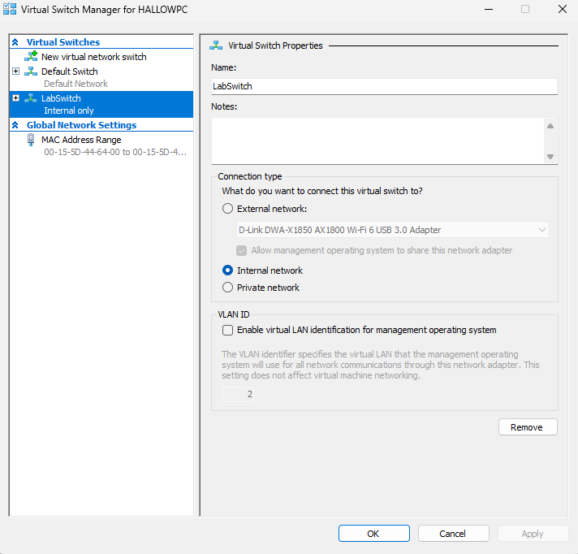

---

## DC01 — Domain Controller

### DC01 Static IP

DC01 assigned static IP `192.168.10.1`, subnet mask `255.255.255.0`, default gateway `192.168.10.254` (pfSense), DNS pointing to itself.

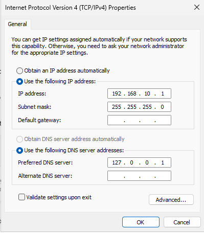

---

## PC01 — Domain Client

### PC01 Rename

PC01 renamed to `PC01` before domain join to match the Contoso naming convention.

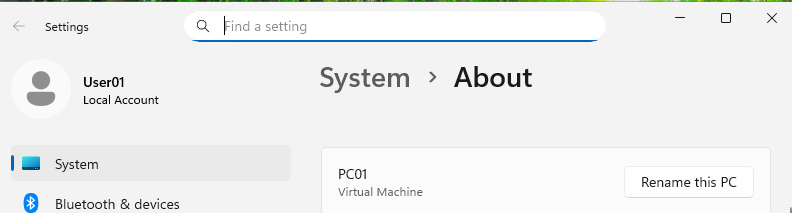

### PC01 Network Settings

PC01 configured with DNS pointing to DC01 at `192.168.10.1` to allow domain resolution.

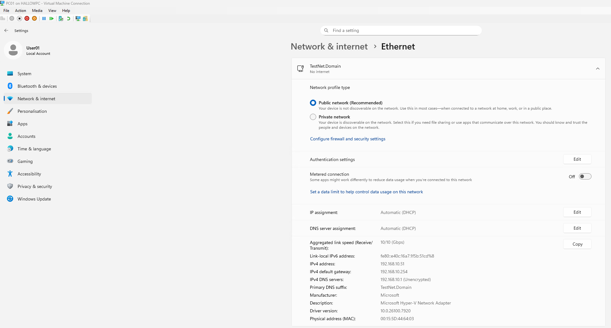

### PC01 Domain Join

PC01 successfully joined to `TestNet.Domain`.

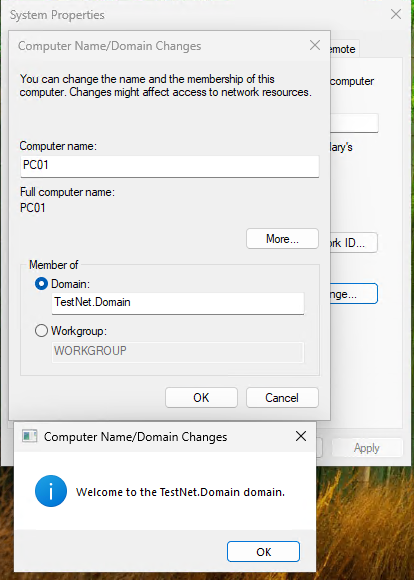

### PC01 System Properties

System Properties on PC01 confirming domain membership.

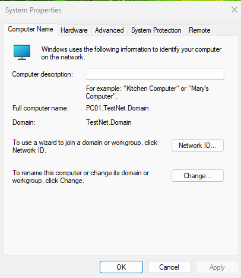

### PC01 Desktop — First Boot

PC01 desktop on first boot after domain join, logged in as a domain user.

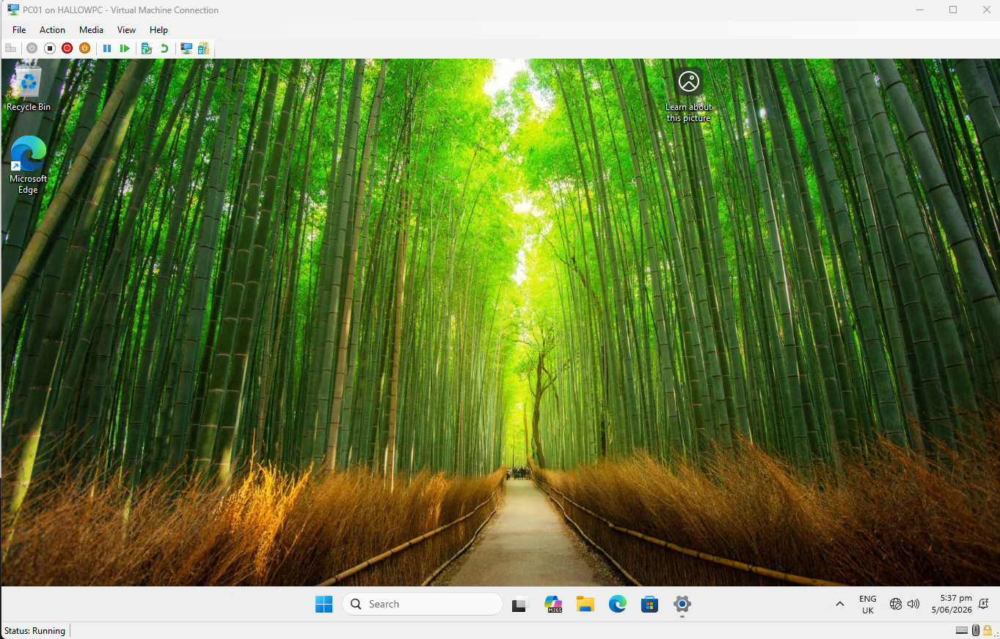

### User01 Login Screen

Domain login screen on PC01 showing a Contoso domain user account at the Windows login prompt.

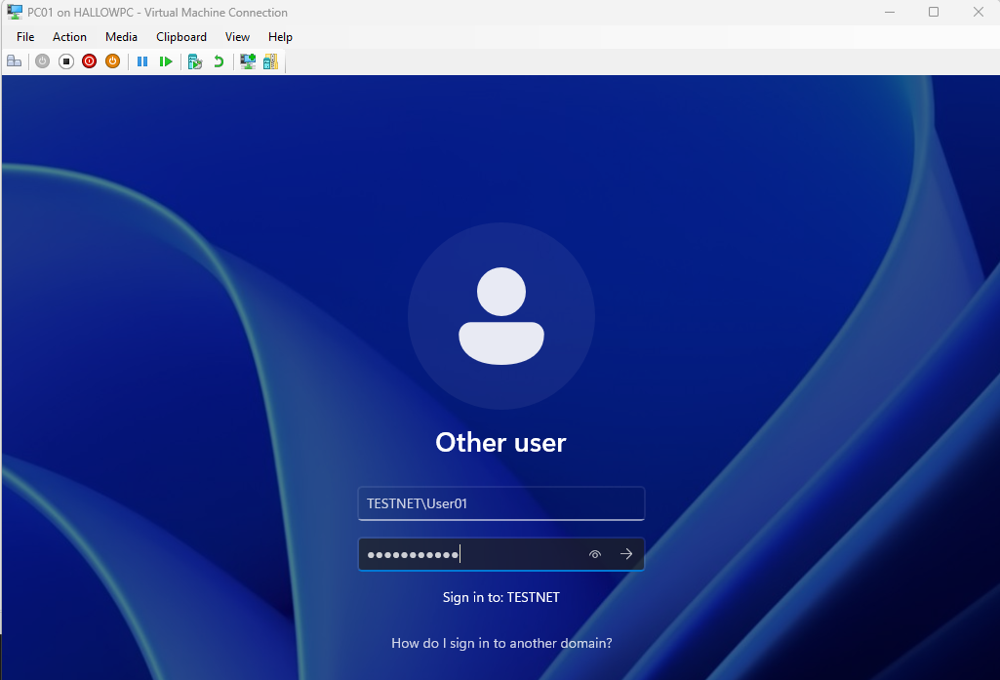

---

## PC02 — Domain Client

### PC02 Network Settings

PC02 configured with DNS pointing to DC01 before domain join.

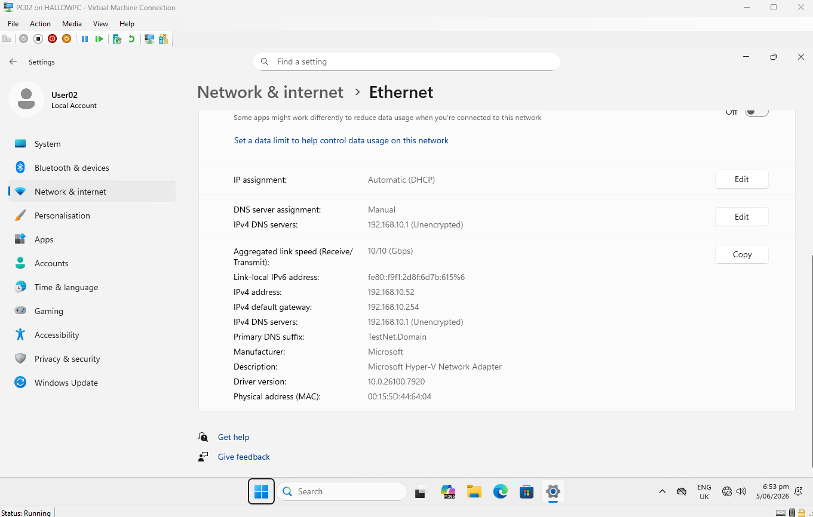

### PC02 Domain Join

PC02 successfully joined to `TestNet.Domain`.

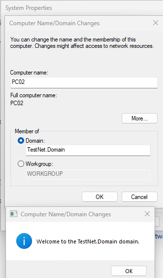

### PC02 System Properties

System Properties on PC02 confirming domain membership.

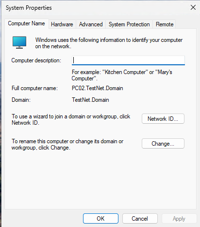

### PC02 Moved to Computers OU

PC02 computer object moved into the Contoso Computers OU inside Active Directory.

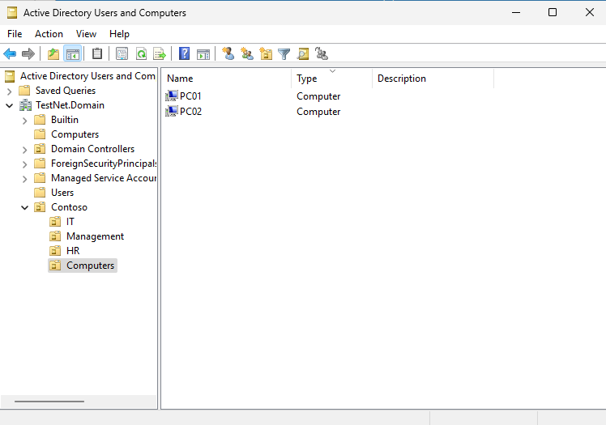

---

## Summary

| VM | Role | IP |
|---|---|---|
| DC01 | Primary Domain Controller | 192.168.10.1 |
| DC02 | Secondary Domain Controller | 192.168.10.2 |
| FS01 | File Server | 192.168.10.3 |
| WEB01 | IIS Web Server | 192.168.10.4 |
| WSUS01 | Patch Management | 192.168.10.5 |
| PC01 | Domain Client | DHCP |
| PC02 | Domain Client | DHCP |
| pfSense | Firewall / NAT | 192.168.10.254 |

---

[← Back to home](../index.md) | [Next: 02 — Active Directory, DNS & DHCP →](02-ad-dns-dhcp.md)
