# 02 — Active Directory, DNS & DHCP

This section covers the full setup of Active Directory Domain Services on DC01, promotion of DC02 as a secondary domain controller, DNS configuration, and DHCP scope deployment.

---

## DC01 — Domain Controller Setup

### AD DS Installation

After installing the AD DS role, the post-deployment configuration wizard promoted DC01 as the forest root domain controller for `TestNet.Domain`.

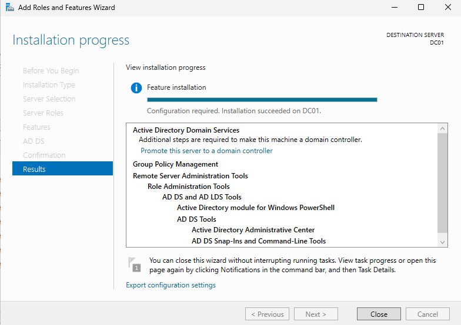

### Server Manager — DC01

Server Manager confirming AD DS, DNS, and DHCP roles are all installed and running on DC01.

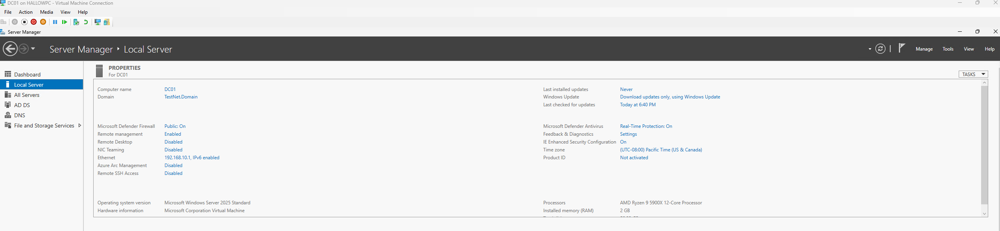

### Domain Review

Summary screen during DC01 promotion showing the domain name, NetBIOS name, and forest/domain functional levels.

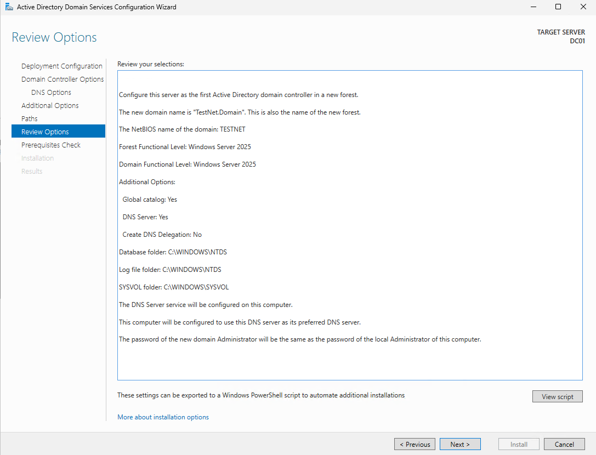

### Active Directory Users and Computers

AD Users and Computers on DC01 showing the domain structure with default containers visible.

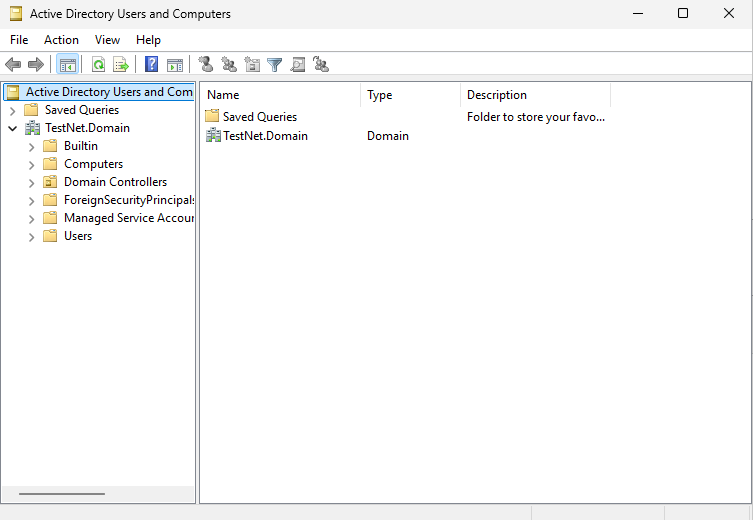

---

## Active Directory — OU Structure & Users

### OU Structure

The Contoso OU structure with IT, Management, HR, and Computers OUs created under the domain.

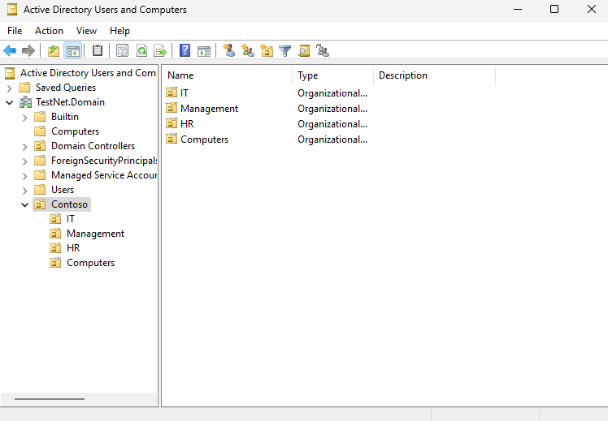

### Users Created — Page 1

First batch of domain user accounts created across the Contoso departments.

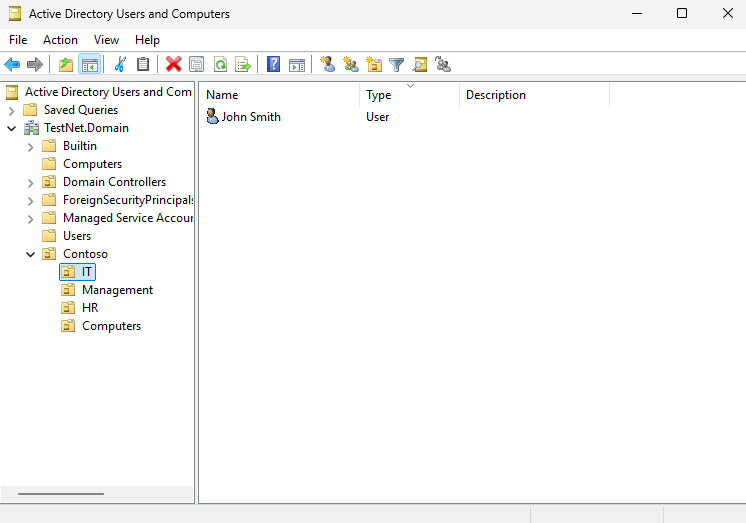

### Users Created — Page 2

Second batch of user accounts, completing the 8 domain users spread across all OUs.

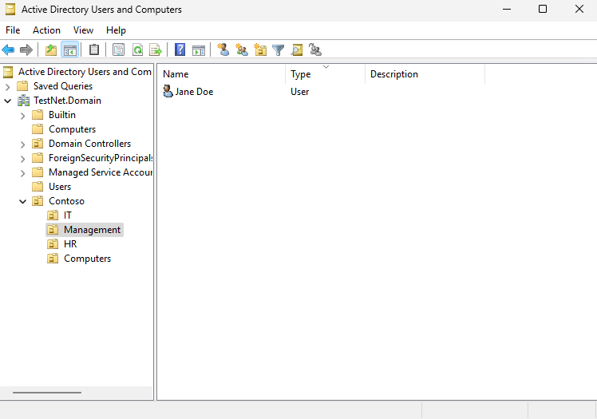

### PC01 Moved to Computers OU

PC01 computer object moved from the default Computers container into the Contoso Computers OU for GPO targeting.

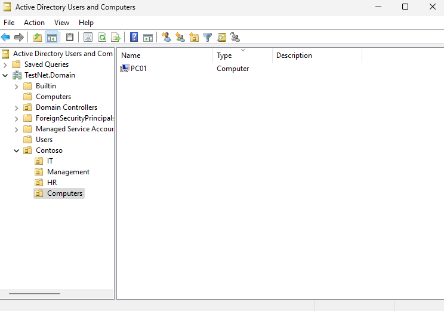

### PC01 Visible in AD

PC01 visible inside AD Users and Computers after joining the domain, confirming successful domain join.

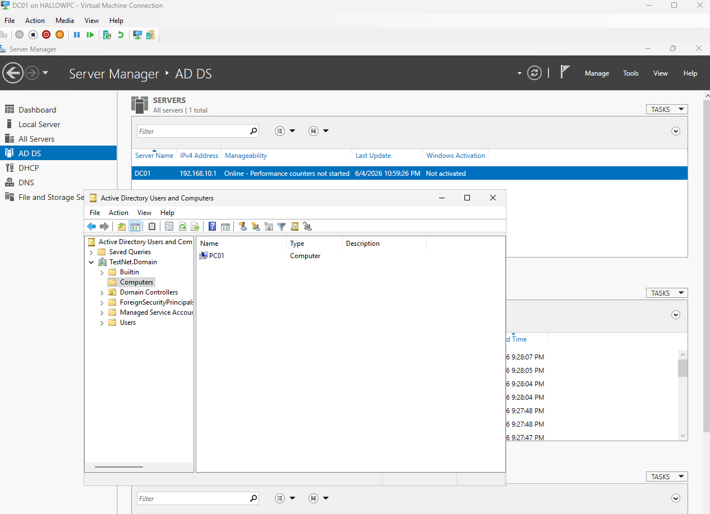

---

## DC02 — Secondary Domain Controller

### DC02 Static IP

DC02 configured with static IP `192.168.10.2`, DNS pointing to DC01 at `192.168.10.1`.

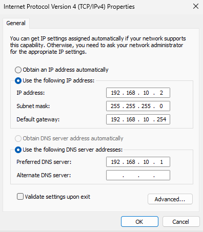

### DC02 Ping Test

DC02 successfully pinging DC01 by IP before domain join, confirming network connectivity.

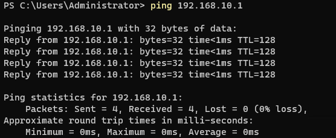

### DC02 Domain Join

DC02 joined to `TestNet.Domain` before being promoted to domain controller.

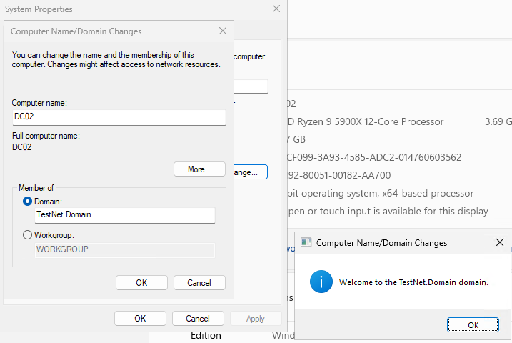

### DC02 AD DS Promotion Success

DC02 successfully promoted as a secondary domain controller in the `TestNet.Domain` forest.

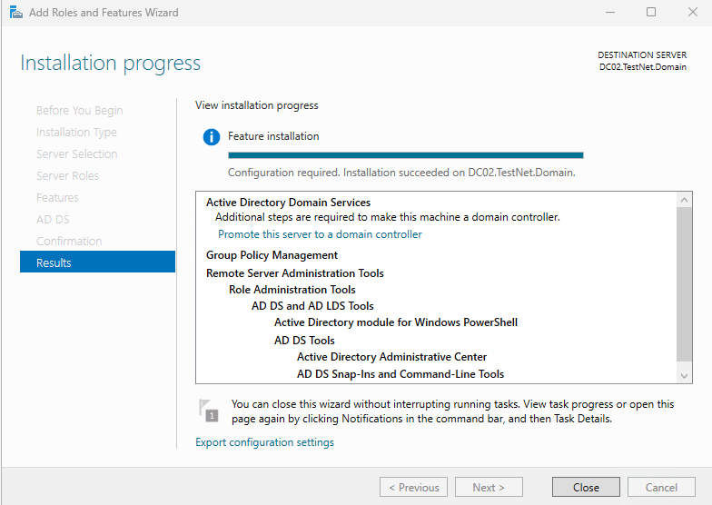

### DC02 Server Manager

Server Manager on DC02 confirming AD DS and DNS roles are installed and running.

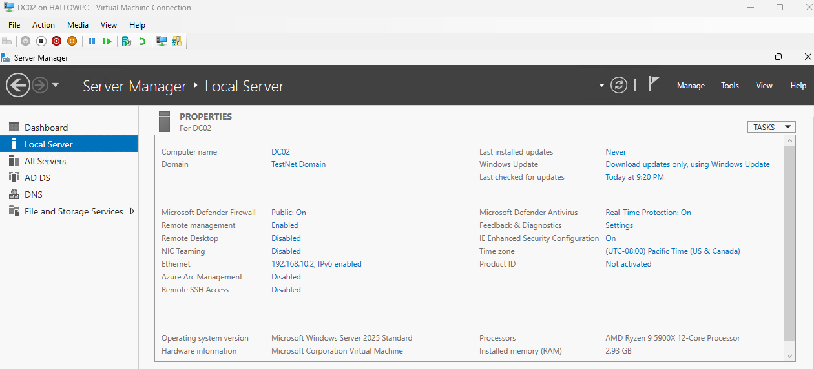

---

## DNS

### NSLookup — DC01 Resolving DC02

`nslookup` run on DC01 successfully resolving DC02 by hostname, confirming DNS is working correctly across both domain controllers.

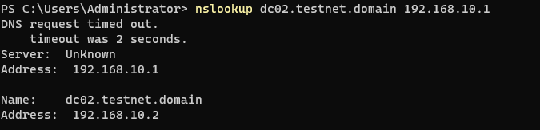

---

## AD Replication

### Repadmin — Initial Run

First `repadmin /replsummary` run on DC01, used to identify any replication issues after DC02 promotion.

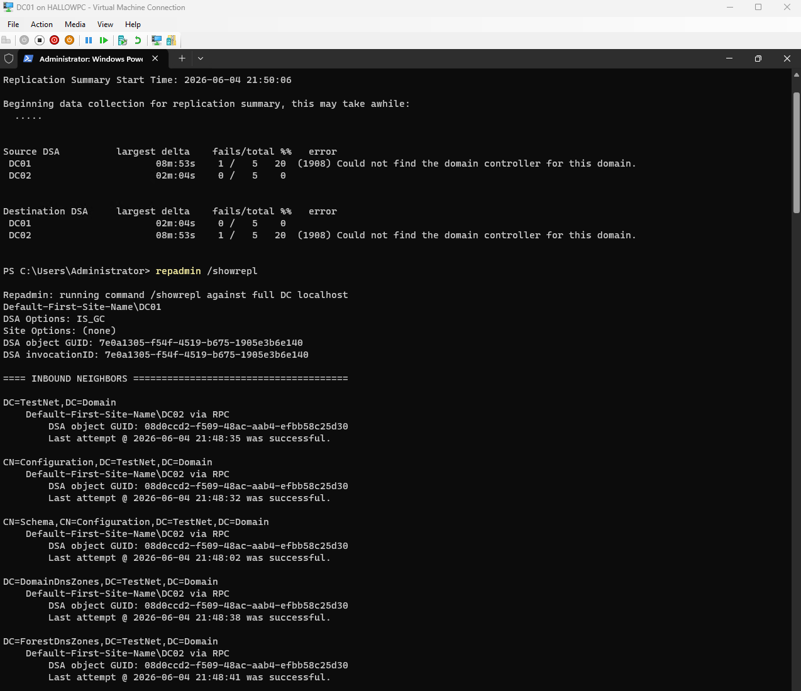

### Repadmin — Fixed

`repadmin /replsummary` after resolving replication issues. Both domain controllers showing healthy replication with 0 failures.

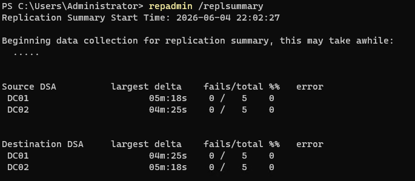

> **Troubleshooting note:** Replication initially failed because DC02's preferred DNS was not pointing to DC01, preventing it from locating the domain. Fixed by updating DC02's DNS to `192.168.10.1` and running `repadmin /syncall /AdeP` to force replication.

---

## DHCP

### DHCP Install Success

DHCP Server role successfully installed on DC01.

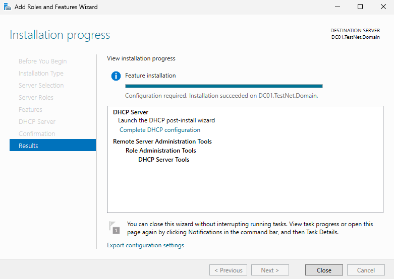

### DHCP Post-Install

Post-installation configuration — DHCP authorised in Active Directory under the domain administrator account.

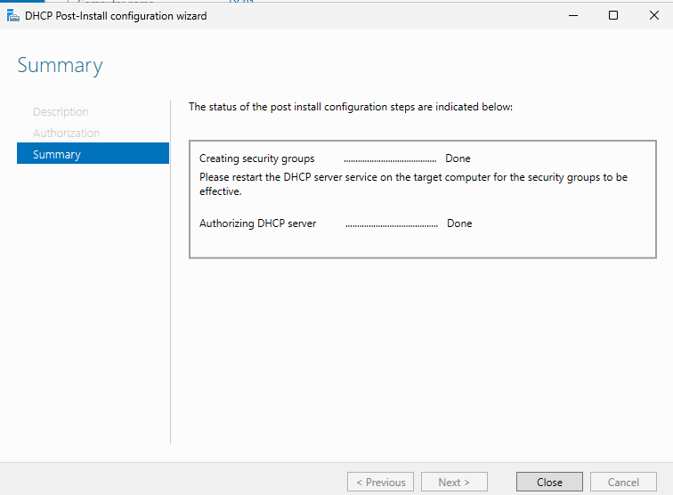

### DHCP Server Manager

Server Manager confirming DHCP role is installed and running on DC01.

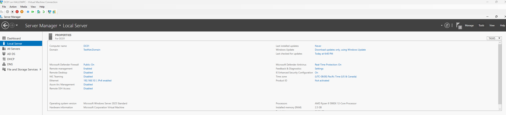

### DHCP Scope Properties

LabScope configured with range `192.168.10.50–100`, subnet mask `255.255.255.0`, and default gateway `192.168.10.254` (pfSense).

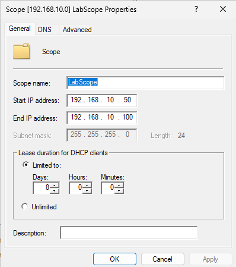

### DHCP Scope Active

LabScope activated and issuing leases to domain-joined client machines.

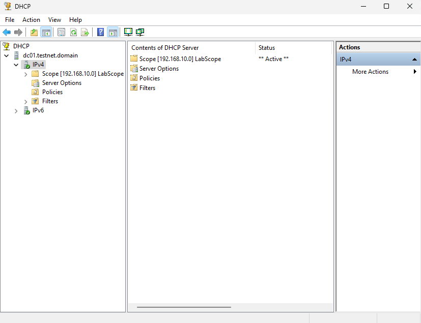

---

## Summary

| Component | Status |
|---|---|
| DC01 — Forest root DC | Configured |
| DC02 — Secondary DC | Configured |
| AD replication | Verified with repadmin |
| OU structure | IT, Management, HR, Computers |
| Domain users | 8 accounts created |
| DNS | Forward and reverse zones on DC01 |
| DHCP | Scope 192.168.10.50–100, authorised in AD |

---

[← 01 — VM Setup](01-vm-setup.md) | [Next: 03 — Group Policy →](03-group-policy.md)
