# 03 — Group Policy

This section covers the creation and deployment of 6 Group Policy Objects across the Contoso domain, covering security, desktop enforcement, USB restriction, drive mapping, and WSUS client targeting.

---

## GPO Overview

### GPO List

All 6 GPOs visible in Group Policy Management, linked to the appropriate OUs across the domain.

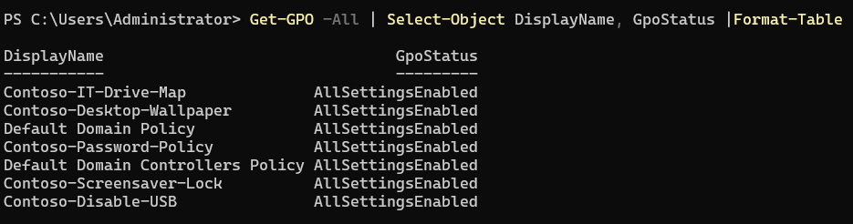

### GPO Linked to IT OU

The IT department GPO linked directly to the IT OU, confirming targeted policy application.

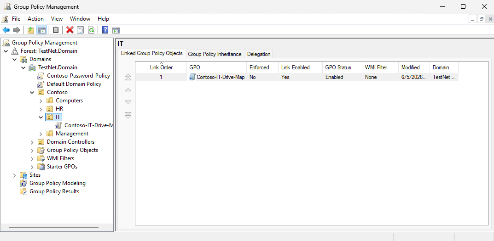

---

## Security Policies

### Password Policy

Password policy GPO configured with complexity requirements, minimum length, and password history settings.

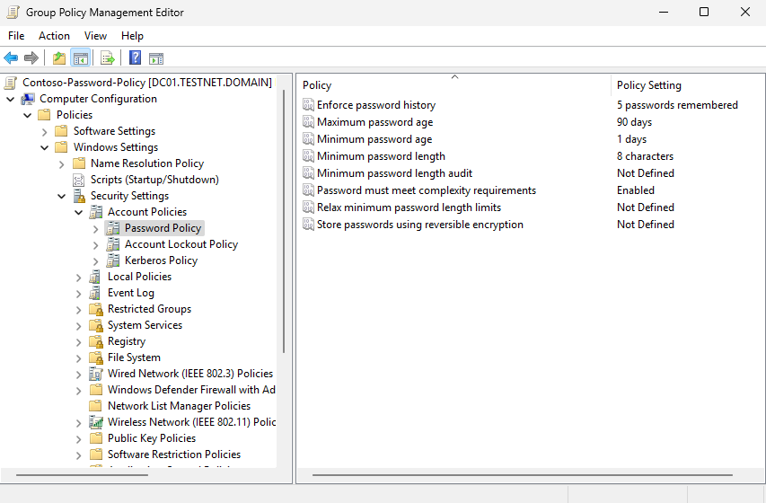

### Account Lockout Policy

Account lockout policy set — locks accounts after failed login attempts to protect against brute force.

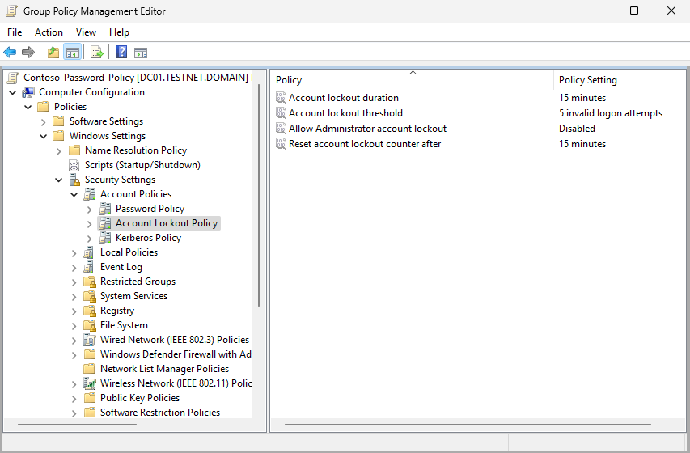

---

## Desktop Enforcement

### Desktop Wallpaper

GPO enforcing the Contoso desktop wallpaper across all domain computers.

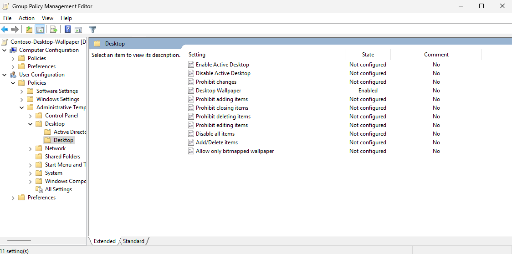

### Screensaver Lock

Screensaver lock policy configured — screen locks automatically after 10 minutes of inactivity.

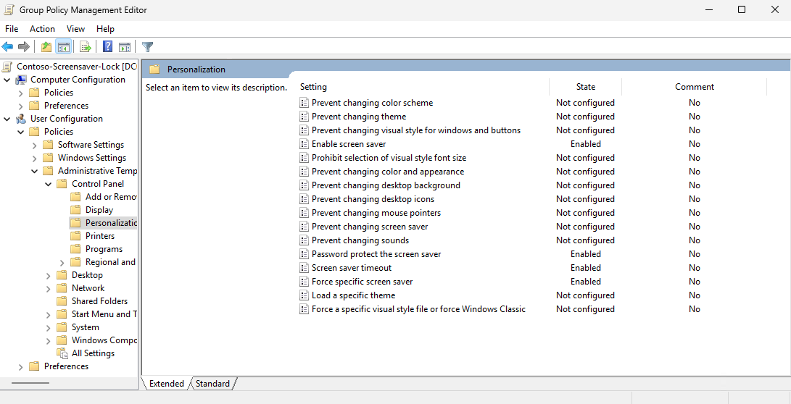

---

## USB Restriction

### Disable USB Storage

GPO blocking USB storage devices across all domain computers to prevent unauthorised data transfer.

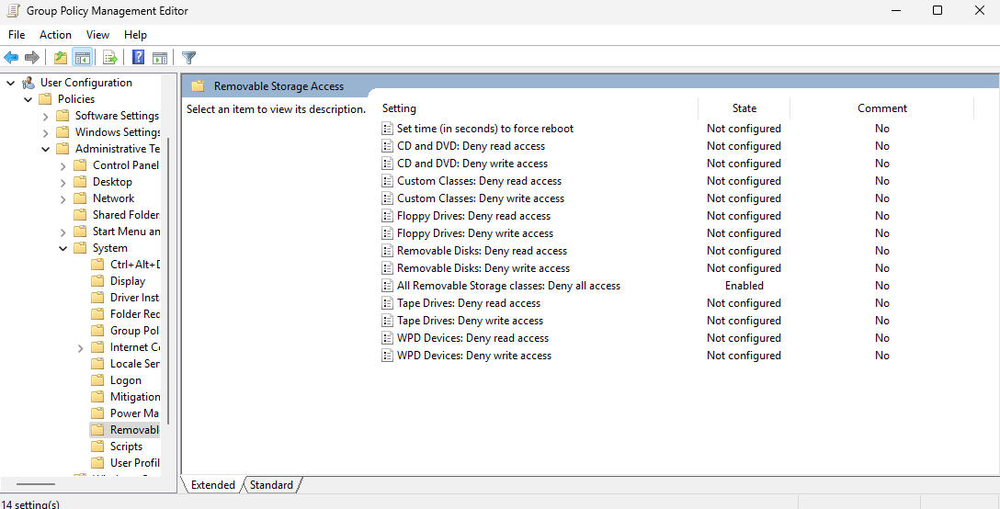

---

## Drive Mapping

### H: Drive Mapping — Policy

GPO configured to map the H: drive to the IT department's home folder share on FS01.

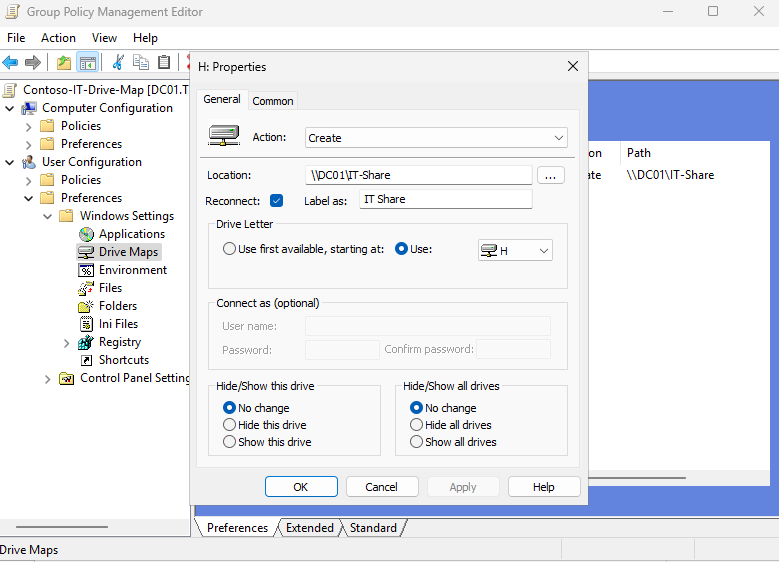

### H: Drive Mapping — Working

H: drive successfully mapped on a domain client, confirming the GPO is applying correctly.

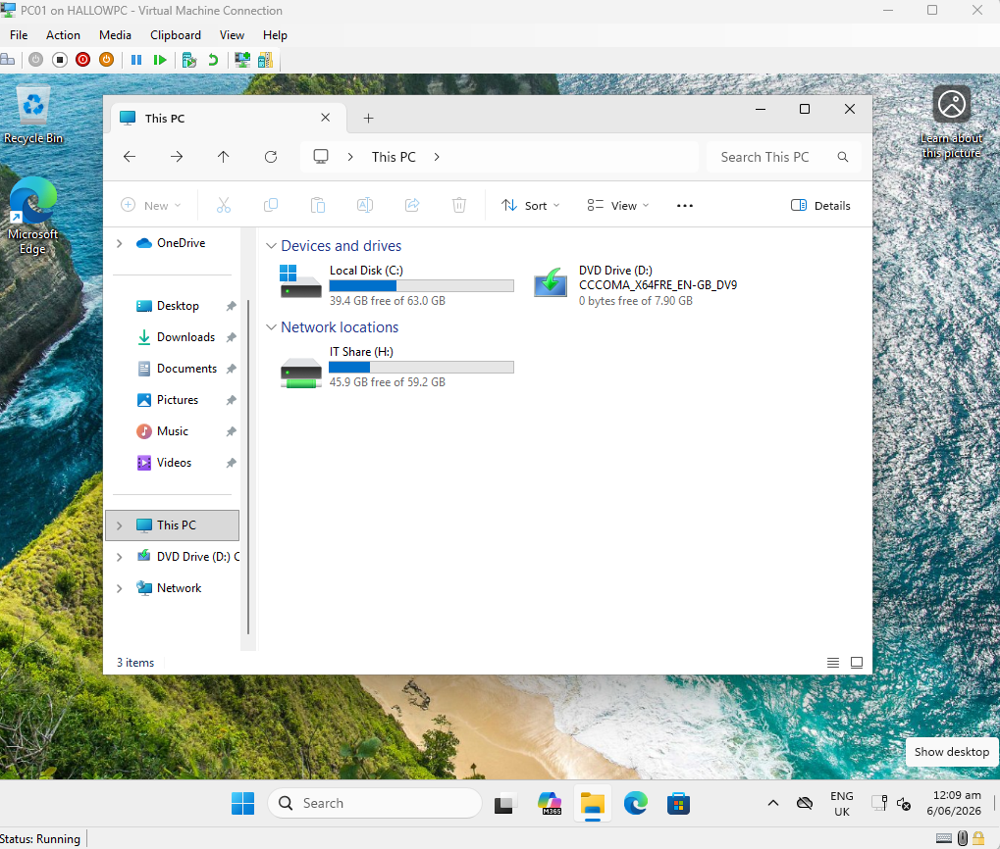

---

## GPO Verification

### GPResult — Page 1

`gpresult /r` run on DC01 showing which GPOs are applied to the computer and user, confirming policies are being processed.

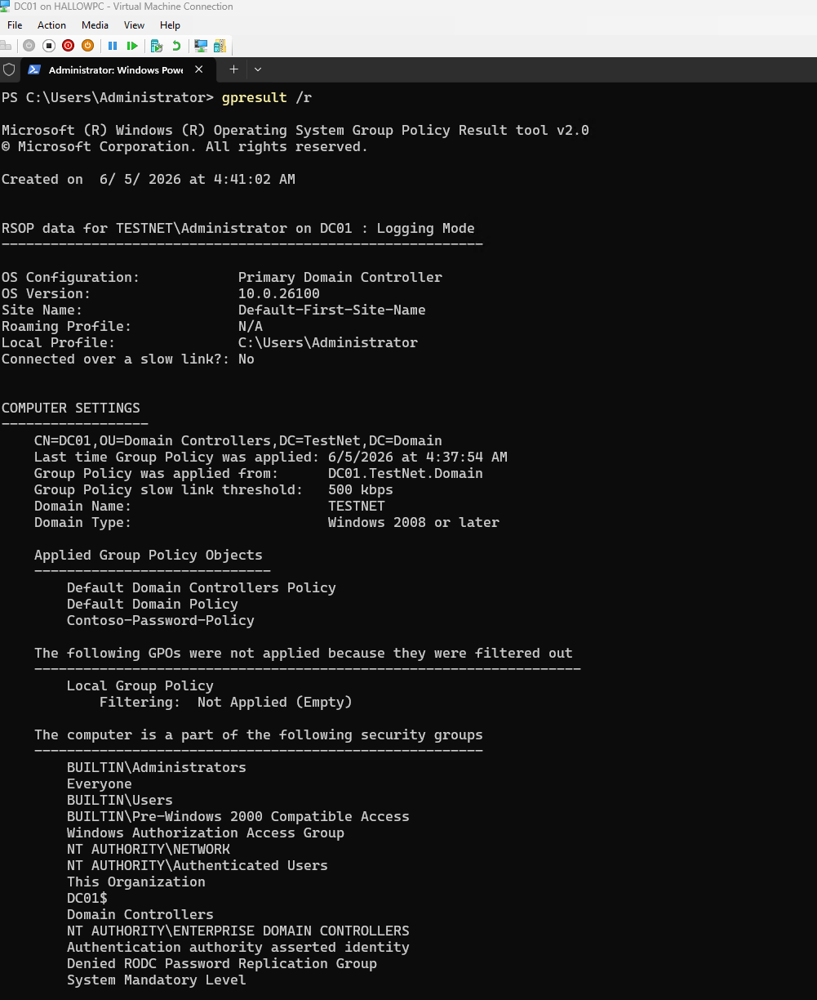

### GPResult — Page 2

Second page of `gpresult /r` output showing additional applied policies and any denied GPOs.

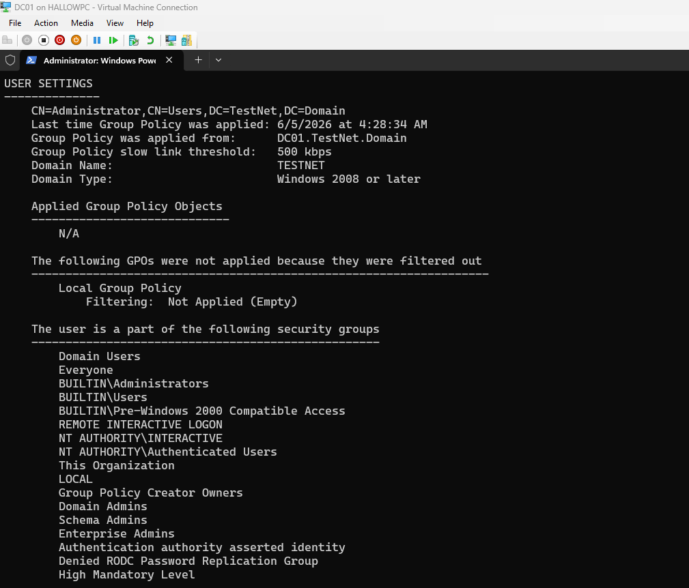

---

## Summary

| GPO | Scope | Purpose |
|---|---|---|
| Password Policy | Domain | Complexity, history, length |
| Account Lockout | Domain | Brute force protection |
| Desktop Wallpaper | Domain | Contoso branding enforcement |
| Screensaver Lock | Domain | 10-minute idle lock |
| USB Restriction | Domain | Block removable storage |
| H: Drive Mapping | IT OU | Map home folder share |

---

[← 02 — Active Directory, DNS & DHCP](02-ad-dns-dhcp.md) | [Next: 04 — File Server →](04-file-server.md)
