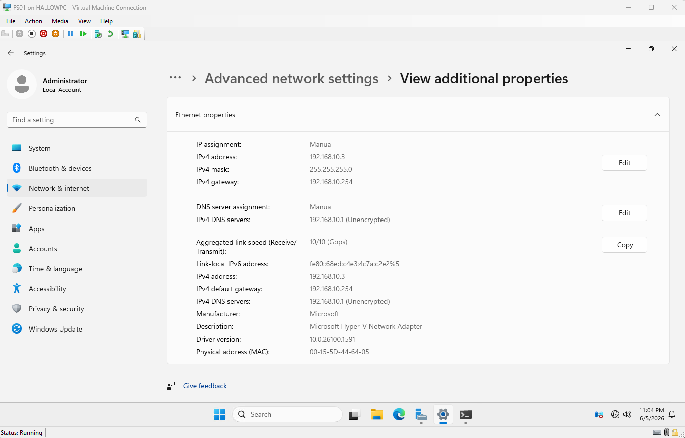
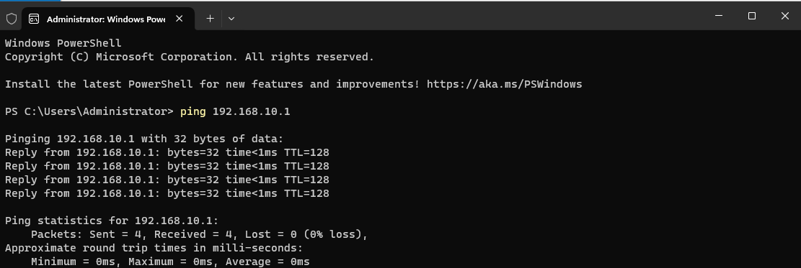
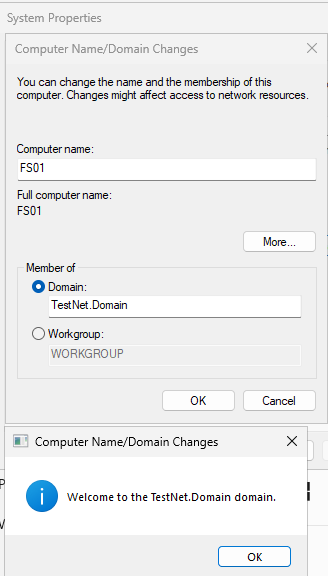
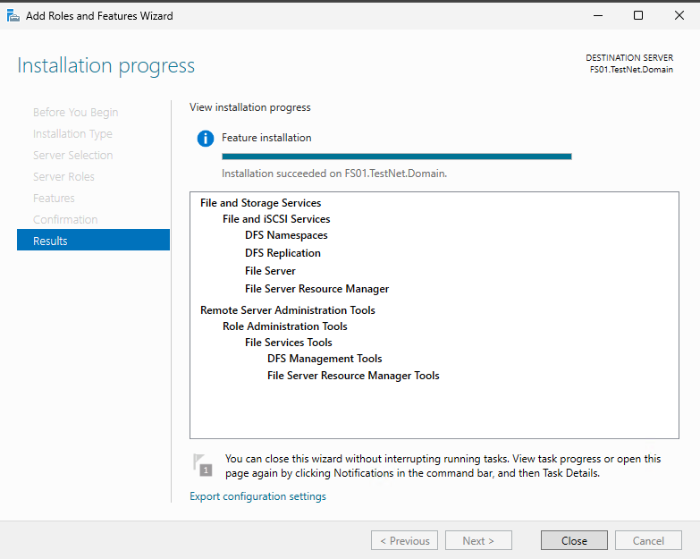
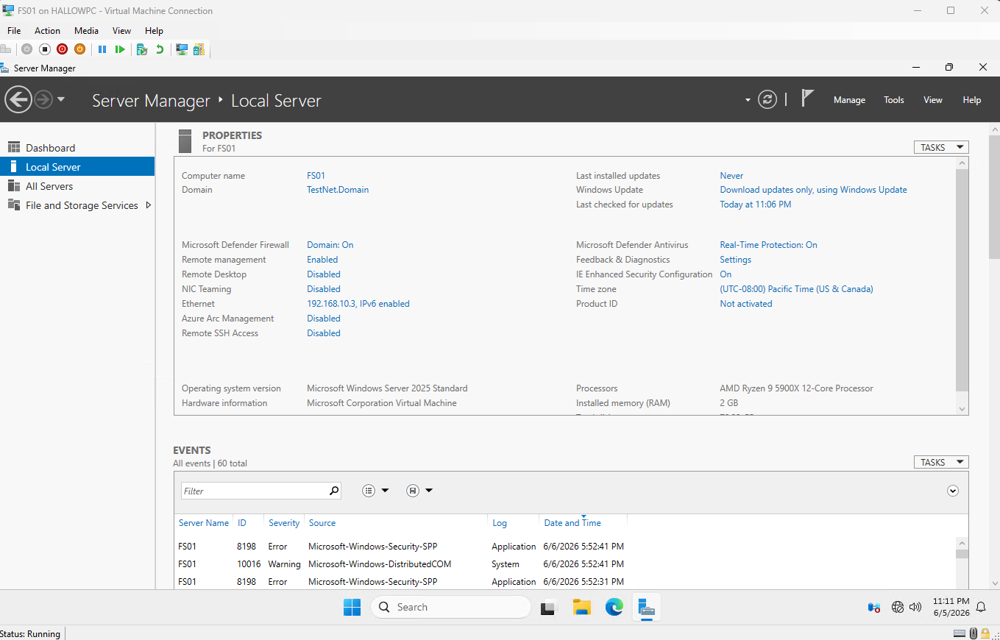
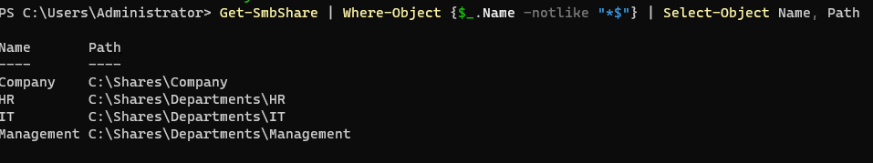
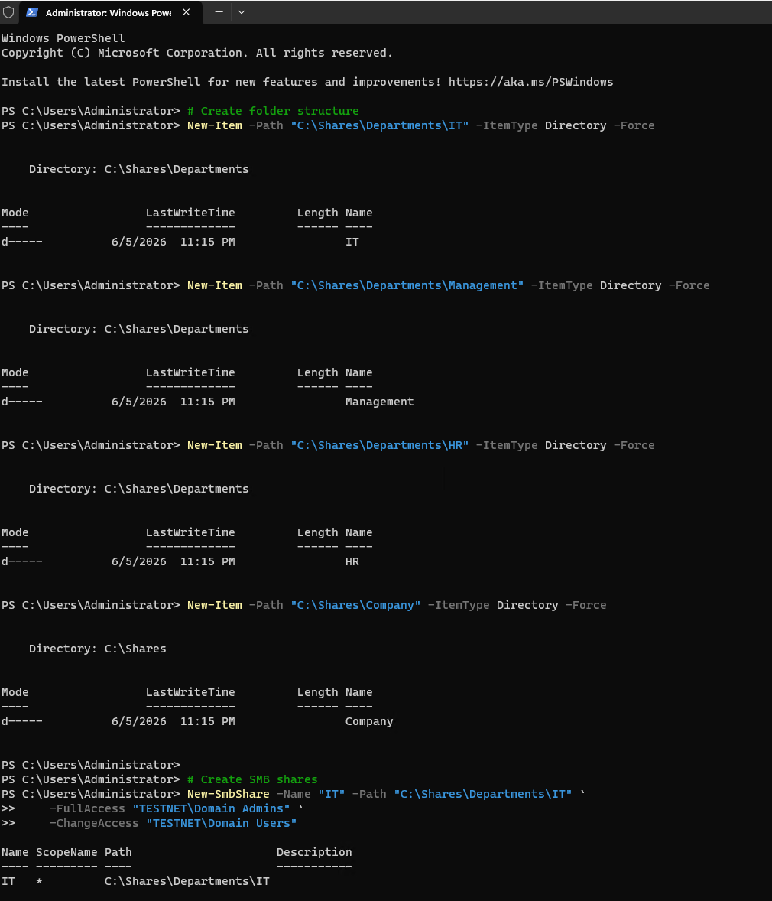
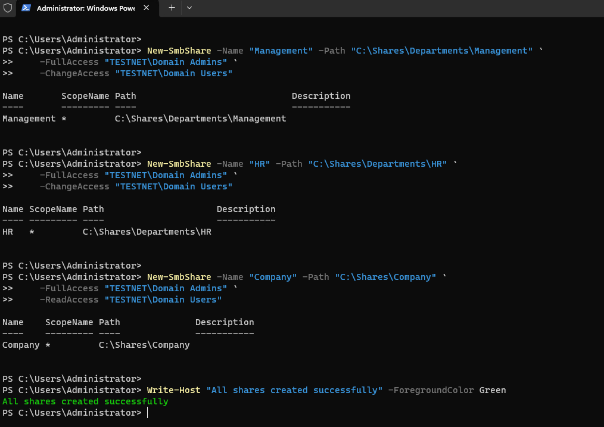
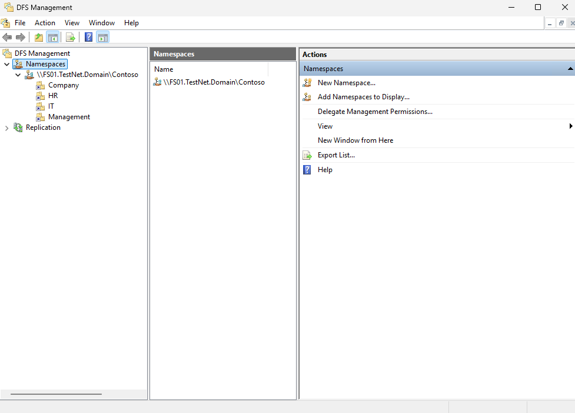
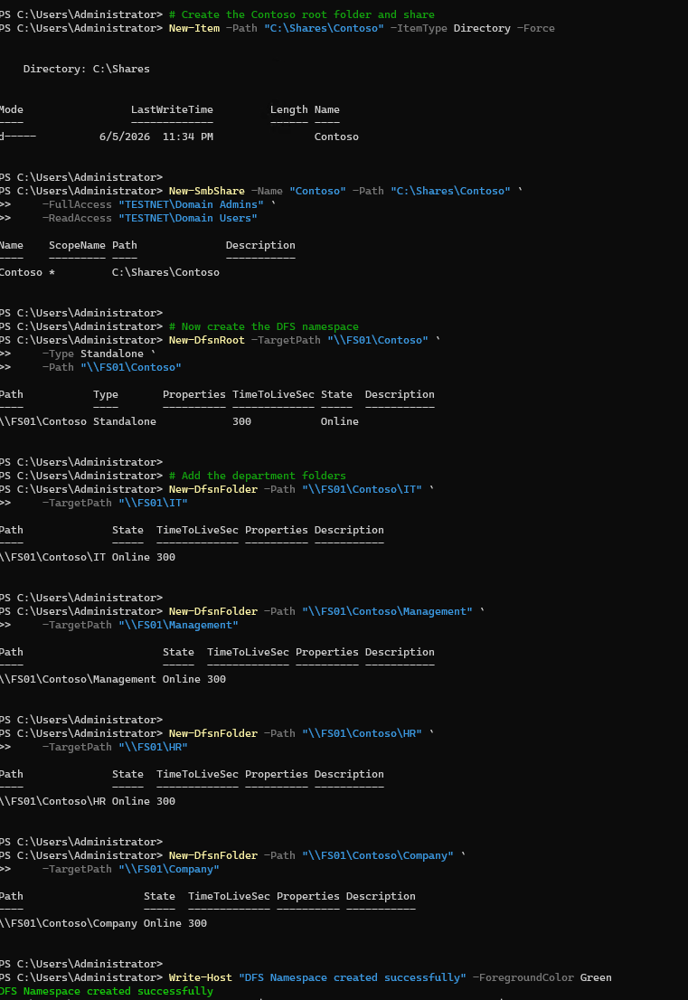

# 04 — File Server

This section covers the setup of FS01 as the Contoso file server, including SMB share creation, DFS namespace, NTFS permissions per department, and disk quotas via File Server Resource Manager.

---

## FS01 — Initial Setup

### FS01 Static IP

FS01 assigned static IP `192.168.10.3`, DNS pointing to DC01.

### FS01 Ping Test

FS01 successfully pinging DC01 at `192.168.10.1`, confirming network connectivity before domain join.

### FS01 Domain Join

FS01 joined to `TestNet.Domain`.

### FS01 Roles Installed

File and Storage Services, DFS Namespaces, and File Server Resource Manager roles installed on FS01.

### FS01 Server Manager

Server Manager on FS01 confirming all required roles are installed and running.

---

## SMB Shares

### Shares List

All department shares visible in File and Storage Services — IT, Management, HR, and Company shares created.

### Shares Created — Page 1

First batch of SMB shares created with NTFS permissions configured per department.

### Shares Created — Page 2

Second batch of shares, completing the full department share structure.

---

## DFS Namespace

### DFS Namespace

DFS Management showing the `\\FS01\Contoso` namespace configured, with department folders mapped underneath.

---

## Disk Quotas

### Disk Quotas

File Server Resource Manager showing disk quota templates applied to the department shares, limiting storage per user.

---

## Summary

| Component | Detail |
|---|---|
| SMB shares | IT, Management, HR, Company |
| DFS namespace | \\FS01\Contoso |
| NTFS permissions | Per department security group |
| Disk quotas | Applied via FSRM |

---

[← 03 — Group Policy](03-group-policy.md) | [Next: 05 — IIS Web Server →](05-iis-webserver.md)
