# 05 — IIS Web Server

This section covers the setup of WEB01 as the Contoso intranet web server, including IIS installation, custom site creation, DNS A record, SSL certificate, and HTTPS binding.

---

## WEB01 — Initial Setup

### WEB01 Rename

WEB01 renamed before domain join to match Contoso naming convention.

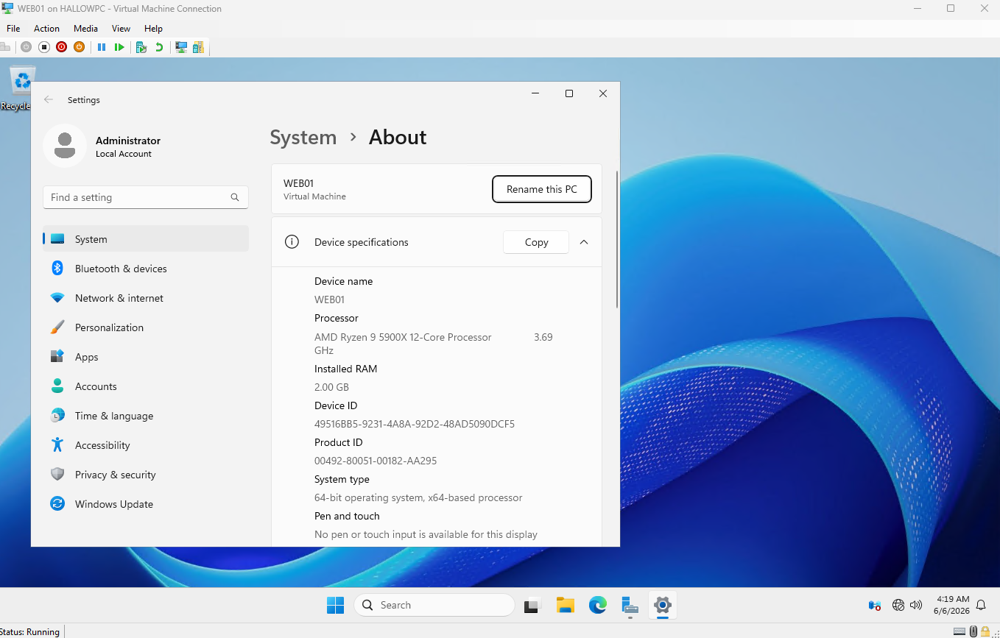

### WEB01 Static IP

WEB01 assigned static IP `192.168.10.4`, DNS pointing to DC01.

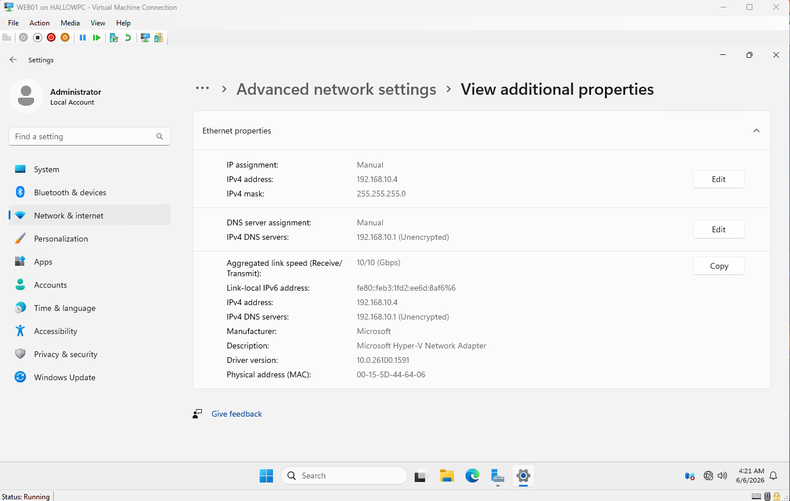

### WEB01 Ping Test

WEB01 pinging DC01 at `192.168.10.1`, confirming connectivity before domain join.

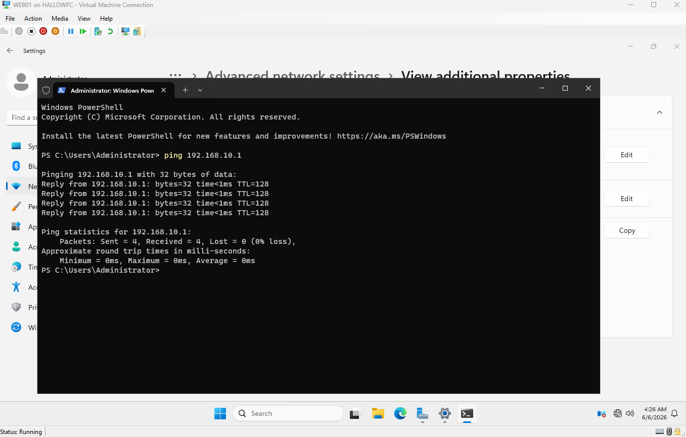

### WEB01 Domain Join

WEB01 joined to `TestNet.Domain`.

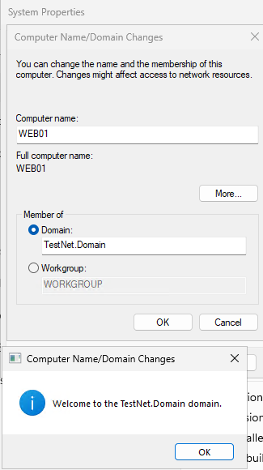

### IIS Installed

IIS role installed on WEB01 via Server Manager.

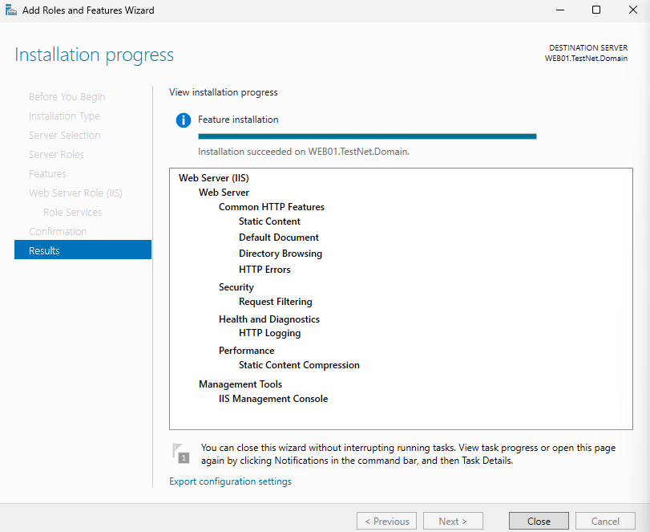

### WEB01 Server Manager

Server Manager on WEB01 confirming the Web Server (IIS) role is installed and running.

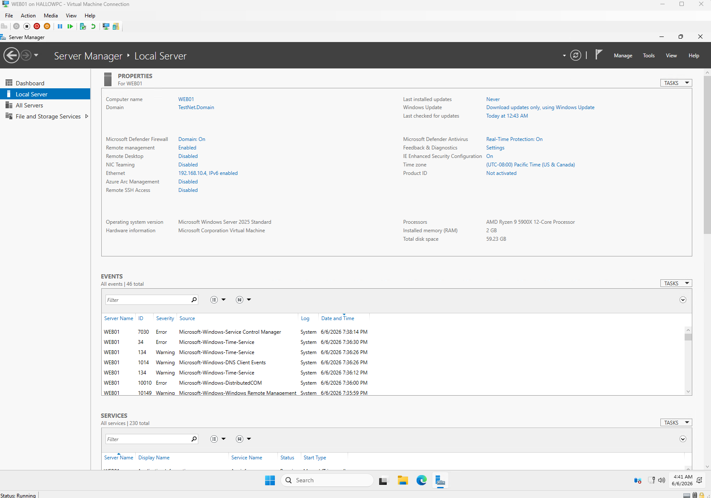

---

## IIS Configuration

### IIS Manager

IIS Manager open on WEB01 showing the default site and the Contoso intranet site listed.

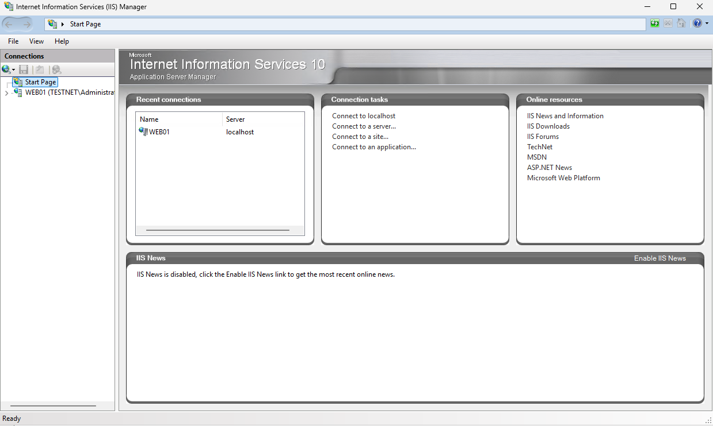

### Default Site

IIS default site visible before the custom Contoso site was created.

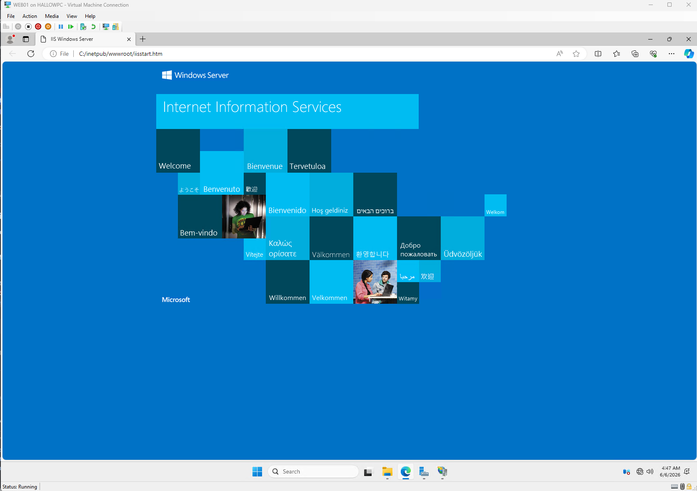

### Intranet Site Created

Custom Contoso intranet site created in IIS with the correct physical path and hostname binding.

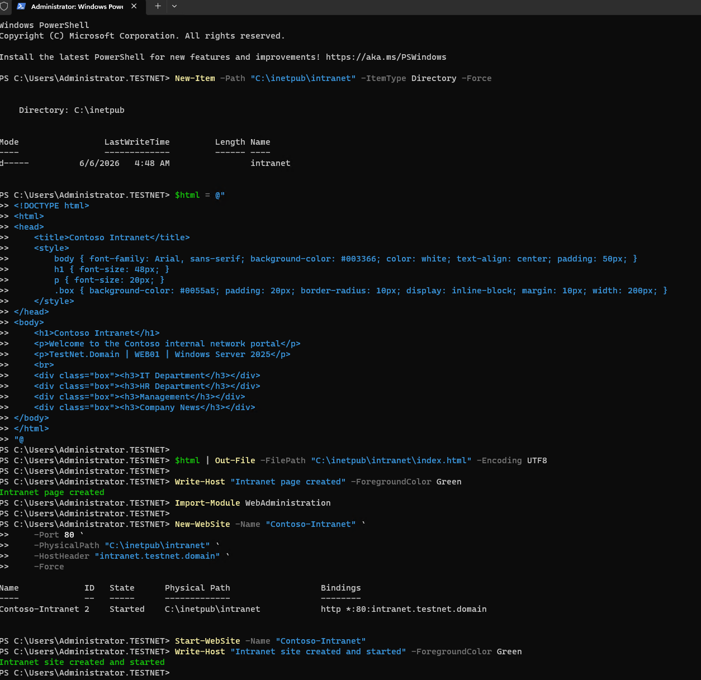

---

## DNS Record

### DNS A Record

DNS A record created on DC01 pointing `intranet.testnet.domain` to WEB01 at `192.168.10.4`.

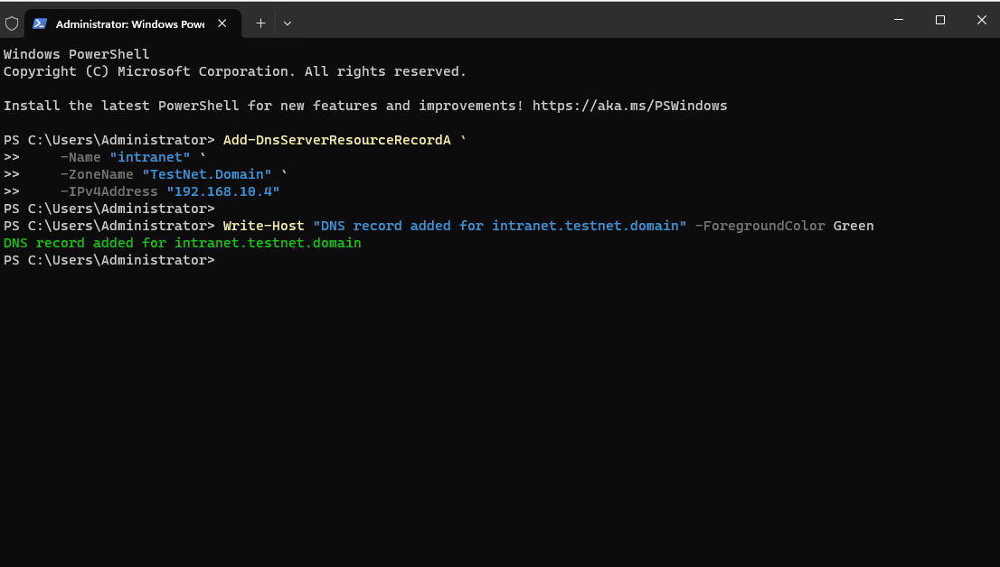

---

## SSL Certificate & HTTPS

### SSL Certificate

Self-signed SSL certificate created on WEB01 and bound to the intranet site for HTTPS access.

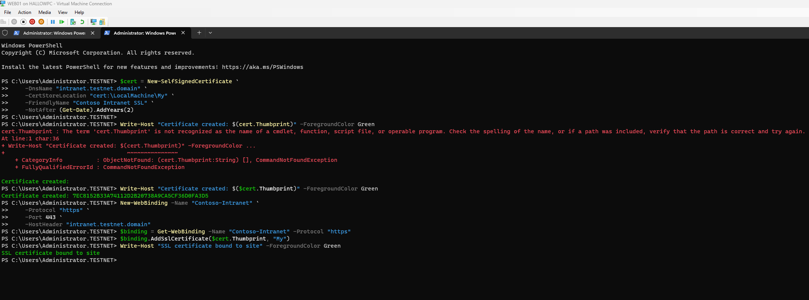

### SSL Warning

Browser SSL warning displayed when accessing the site via HTTPS — expected behaviour for a self-signed certificate in a lab environment.

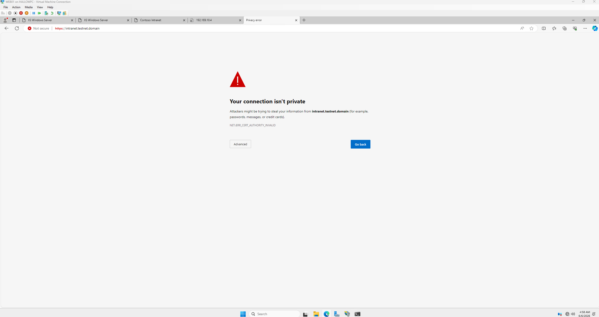

### Intranet Site — HTTP

Custom Contoso intranet homepage loading over HTTP via `intranet.testnet.domain`.

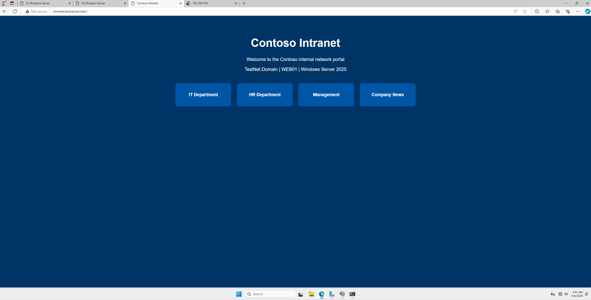

### Intranet Site — HTTPS

Contoso intranet homepage loading over HTTPS, confirming SSL binding is working.

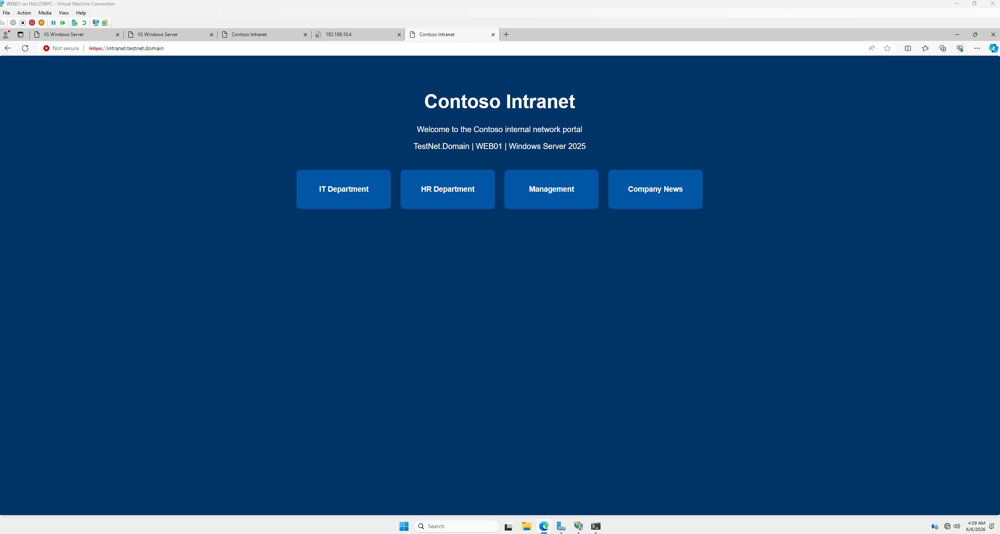

---

## Summary

| Component | Detail |
|---|---|
| IIS site | Contoso intranet |
| DNS record | intranet.testnet.domain → 192.168.10.4 |
| HTTP binding | Port 80 |
| HTTPS binding | Port 443 with self-signed SSL |

---

[← 04 — File Server](04-file-server.md) | [Next: 06 — WSUS →](06-wsus.md)
