# 06 — WSUS Patch Management

This section covers the setup of WSUS01 as the Contoso patch management server, including role installation, configuration, product and classification selection, sync scheduling, and GPO-based client targeting.

---

## WSUS01 — Initial Setup

### WSUS01 Static IP

WSUS01 assigned static IP `192.168.10.5`, DNS pointing to DC01.

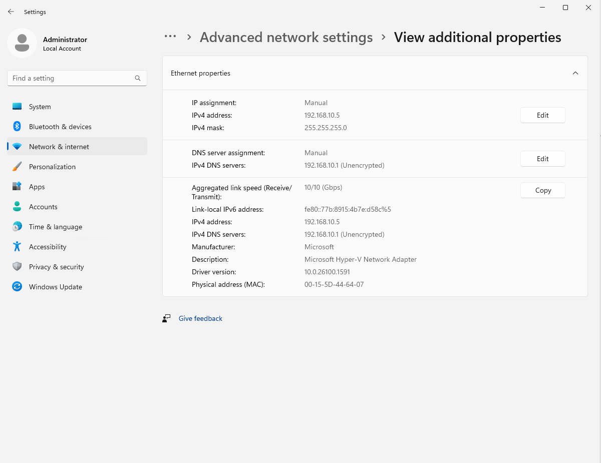

### WSUS01 Ping Test

WSUS01 pinging DC01, confirming connectivity before domain join.

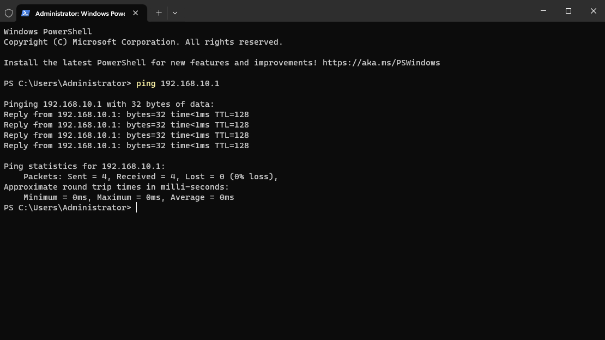

### WSUS01 Domain Join

WSUS01 joined to `TestNet.Domain`.

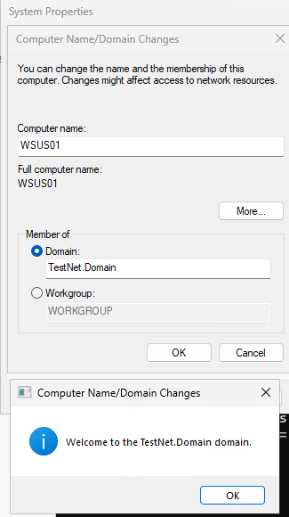

### WSUS Role Installed

Windows Server Update Services role installed on WSUS01.

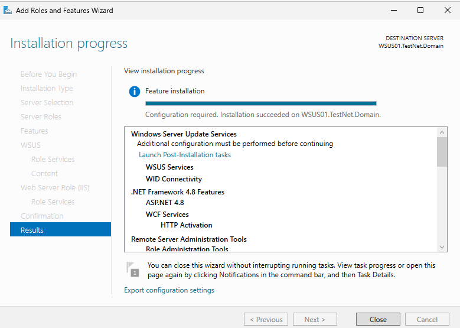

### WSUS01 Server Manager

Server Manager on WSUS01 confirming the WSUS role is installed and running.

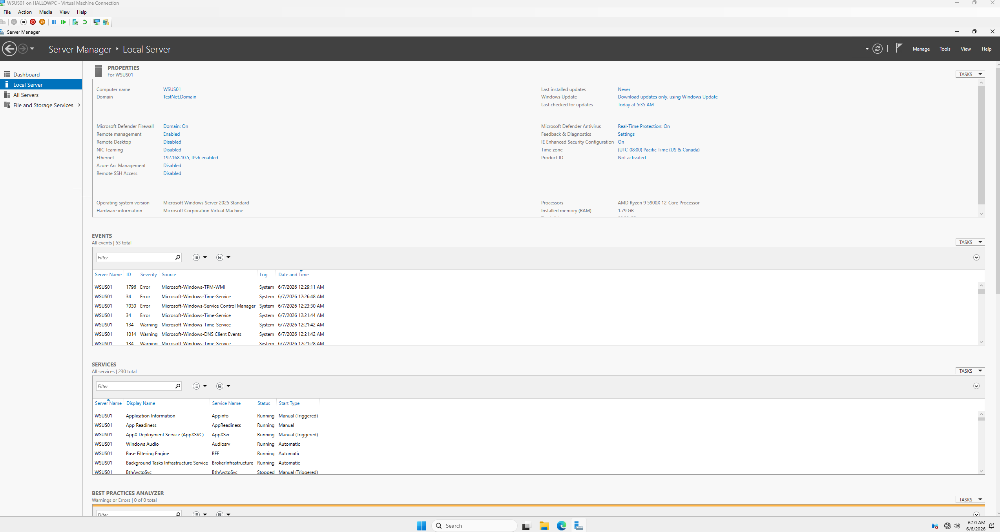

### WSUS Post-Install

Post-installation configuration complete — WSUS content directory and database configured.

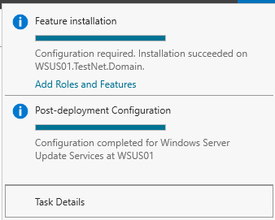

---

## WSUS Configuration

### Update Source

WSUS configured to sync updates from Microsoft Update directly.

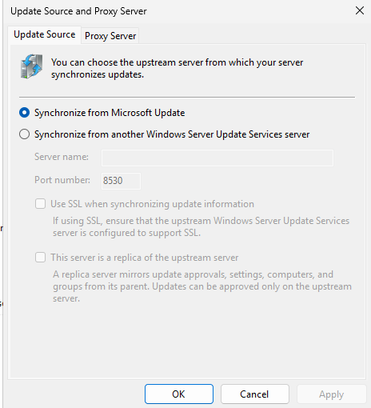

### Products Selected

Windows Server 2025 and Windows 11 selected as the target products for update synchronisation.

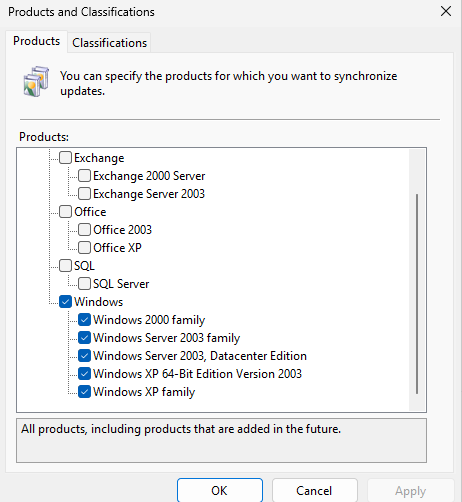

### Classifications Selected

Update classifications configured — Critical Updates, Security Updates, and Definition Updates selected.

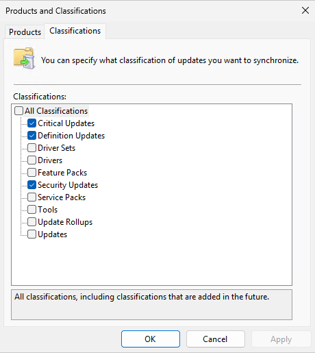

### Sync Schedule

Automatic synchronisation schedule configured to keep updates current.

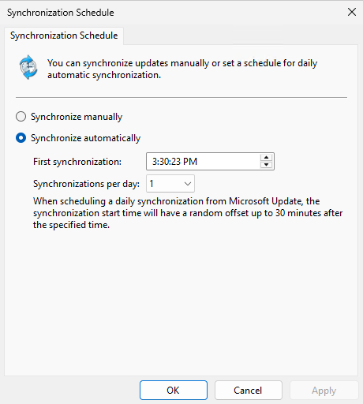

### WSUS Configured

WSUS configuration wizard completed — server ready to serve updates to domain clients.

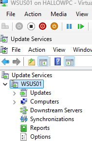

### WSUS Console

WSUS management console showing the server is online and synchronisation is active.

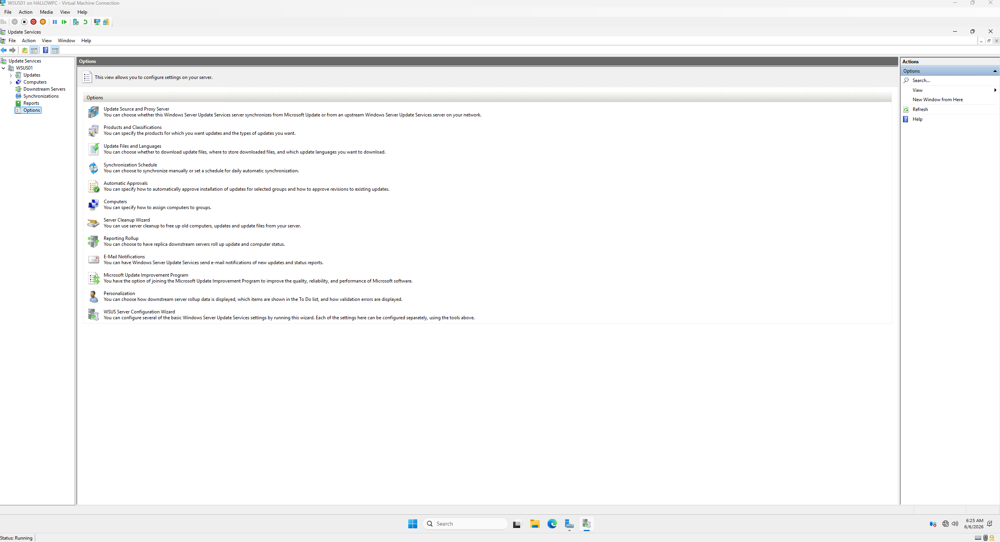

---

## GPO — Client Targeting

### GPO Update Server

GPO configured to point all domain computers to `WSUS01:8530` for Windows Update.

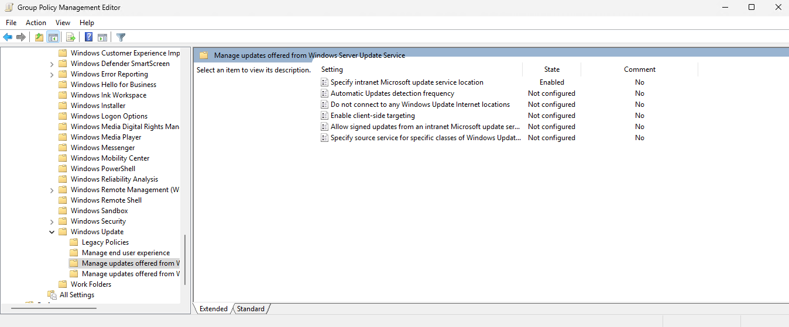

### GPO Auto Update Settings

Automatic update behaviour configured via GPO — clients set to download and notify before install.

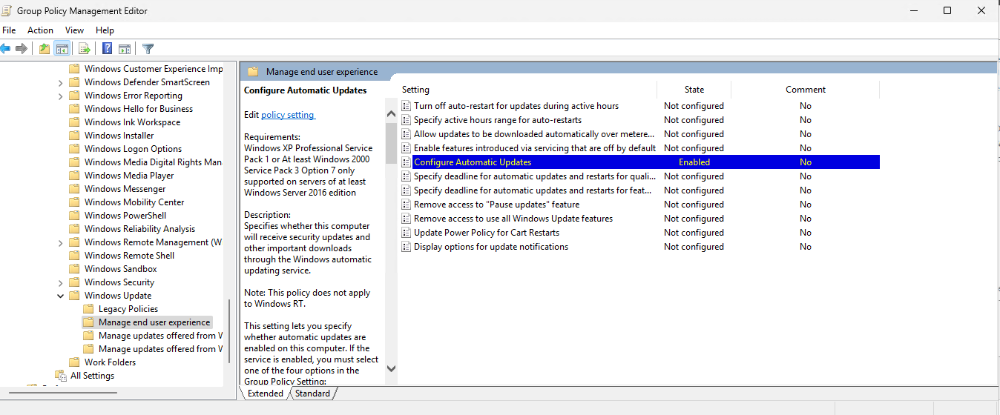

### GPO Client-Side Targeting

Client-side targeting enabled via GPO — computers automatically placed into target groups in the WSUS console.

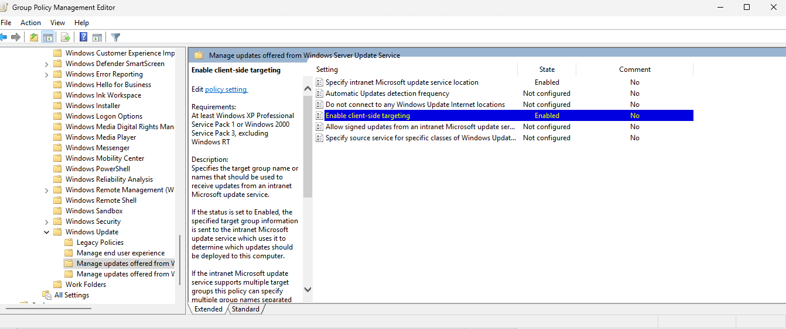

---

## Summary

| Component | Detail |
|---|---|
| WSUS server | WSUS01 — 192.168.10.5 |
| Update source | Microsoft Update |
| Products | Windows Server 2025, Windows 11 |
| Client pointing | GPO → WSUS01:8530 |
| Client targeting | GPO-based, automatic group assignment |

---

[← 05 — IIS Web Server](05-iis-webserver.md) | [Next: 07 — pfSense →](07-pfsense.md)
