# 07 — pfSense Firewall

This section covers the deployment of pfSense CE as the Contoso network firewall, including VM setup in Hyper-V, interface configuration, NAT routing, and custom firewall rules.

---

## pfSense — VM Setup

### VM Settings

pfSense VM configured in Hyper-V with two network adapters — one connected to the external switch (internet) and one to LabSwitch (internal network).

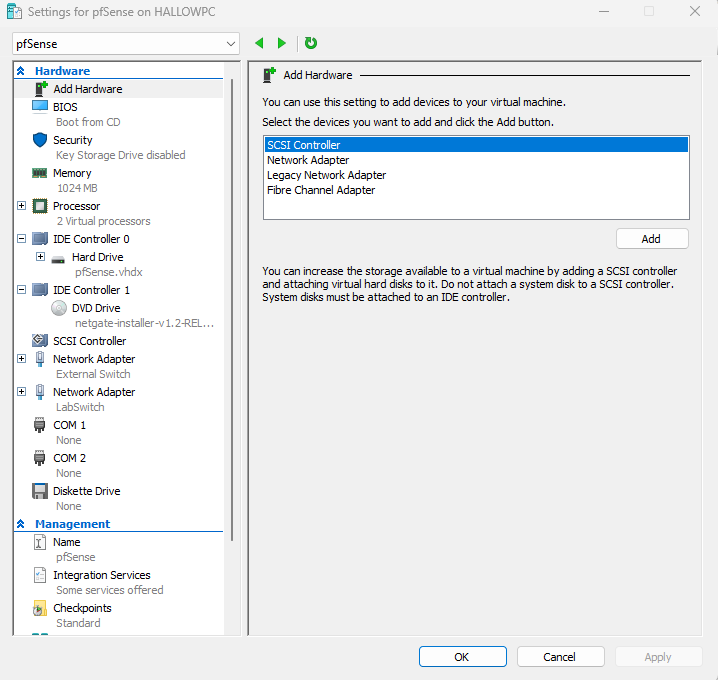

### External Switch

External virtual switch created in Hyper-V to give pfSense access to the internet via the host machine's network adapter.

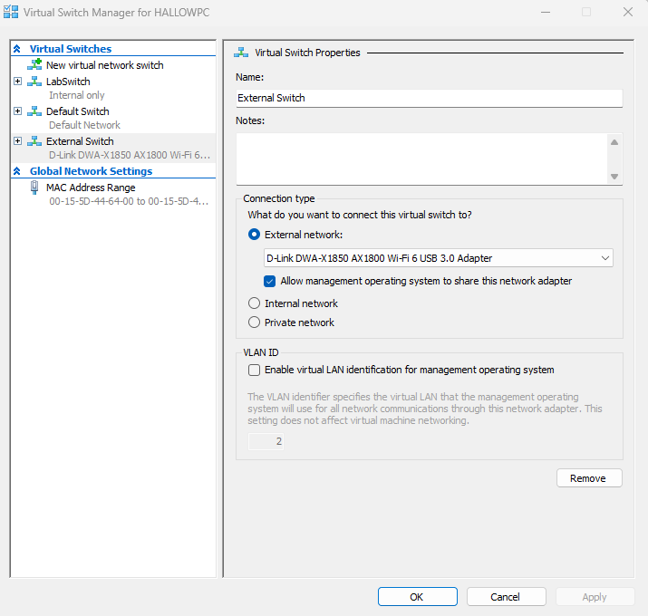

---

## pfSense — Initial Configuration

### Console

pfSense console on first boot showing the WAN and LAN interface assignments.

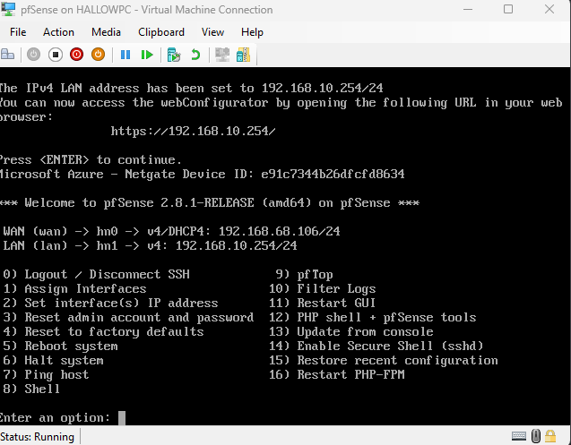

### Interface Assignment

WAN and LAN interfaces assigned to the correct Hyper-V network adapters.

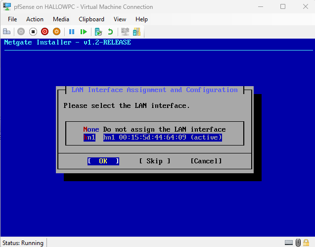

### Interface Confirmation

Interface assignment confirmed — WAN on external adapter, LAN on LabSwitch at `192.168.10.254`.

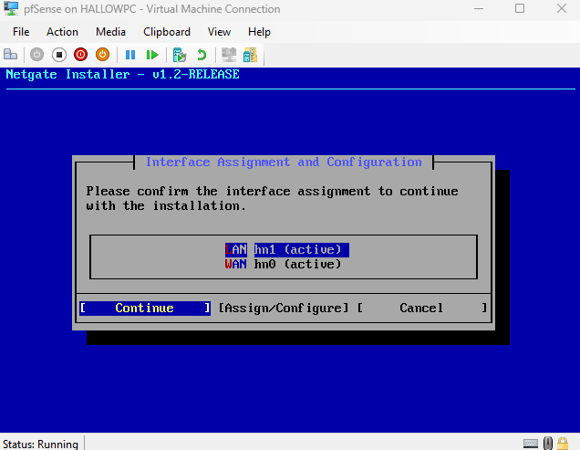

### LAN Configuration

LAN interface configured with static IP `192.168.10.254`, acting as the default gateway for all lab machines.

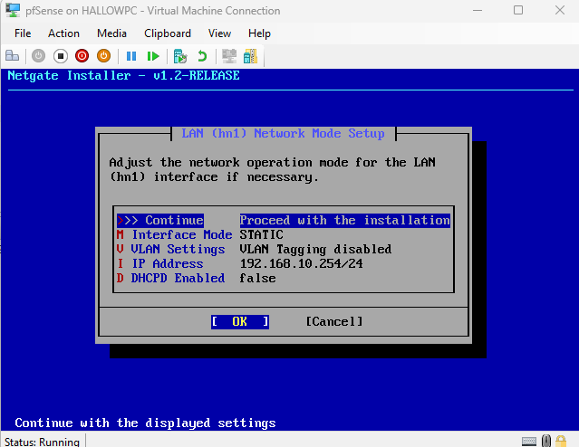

---

## pfSense — Web GUI

### Login

pfSense web GUI login page accessed from DC01 at `192.168.10.254`.

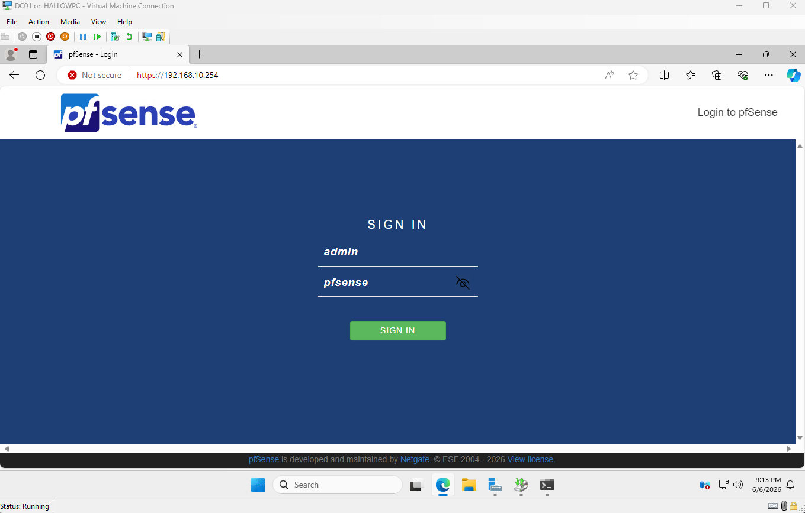

### Setup Wizard

Initial setup wizard completed — hostname, DNS, and NTP configured.

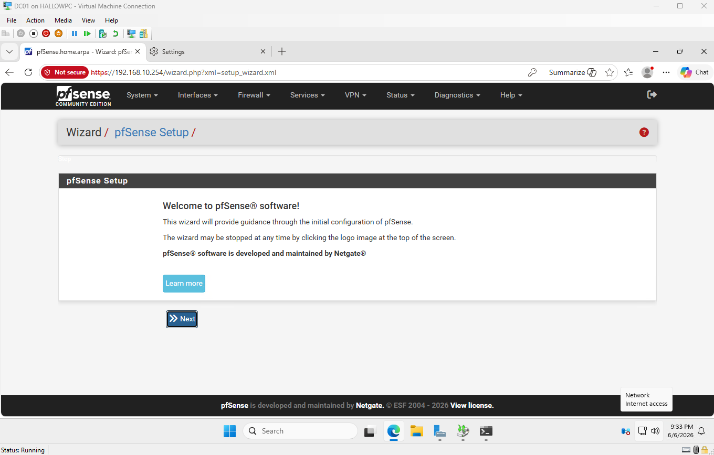

### Dashboard

pfSense dashboard showing both interfaces online, system uptime, and current traffic.

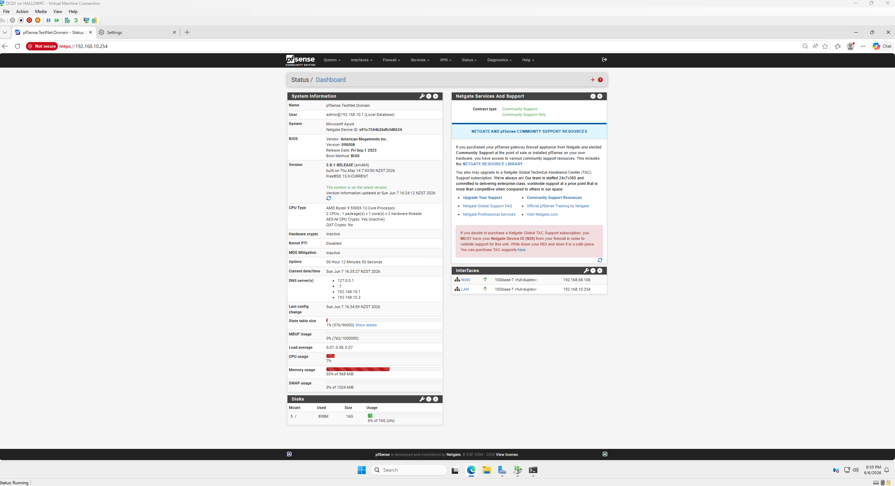

---

## Firewall Rules

### Firewall Rules

Custom firewall rules configured on the LAN interface — default allow rule active with Telnet (port 23) explicitly blocked.

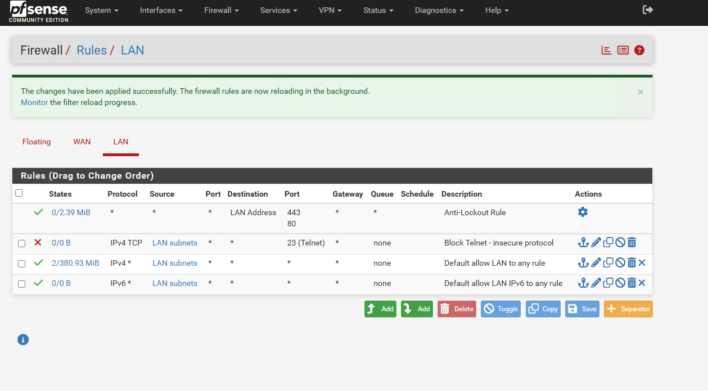

---

## Internet Connectivity Verification

### DC01 Internet Access

DC01 successfully reaching the internet through pfSense NAT, confirming routing and NAT are working correctly.

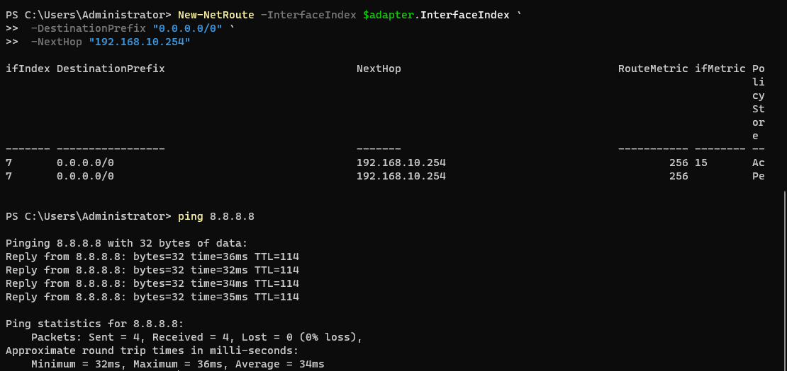

---

## Summary

| Component | Detail |
|---|---|
| pfSense version | CE 2.8.1 |
| WAN | External (DHCP from host) |
| LAN | 192.168.10.254 / LabSwitch |
| NAT | Enabled — all lab VMs route through pfSense |
| Custom rules | Telnet blocked on LAN |

---

[← 06 — WSUS](06-wsus.md) | [Next: 08 — PowerShell Automation →](08-powershell-automation.md)
