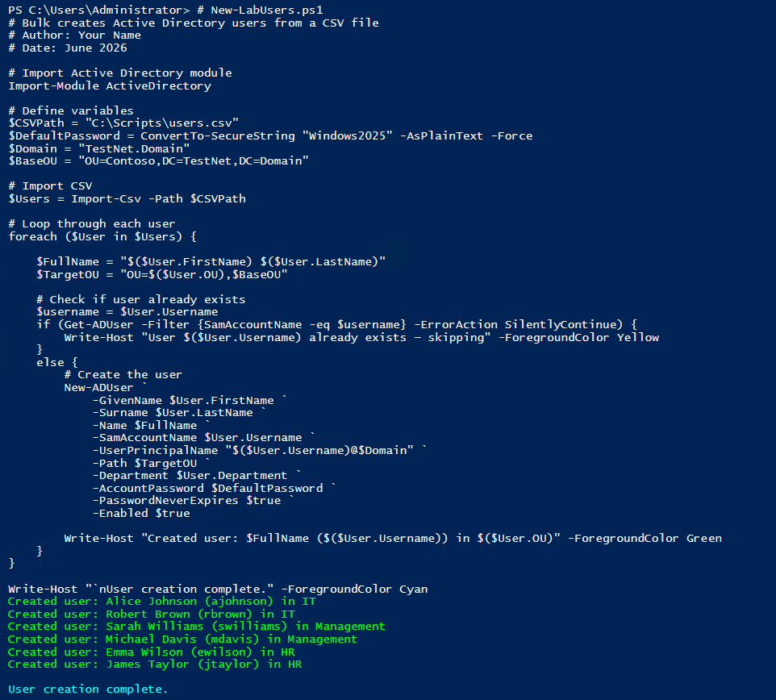
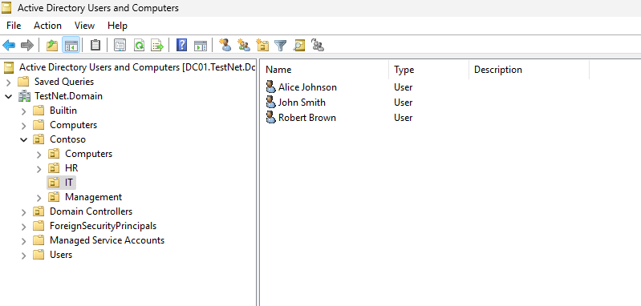
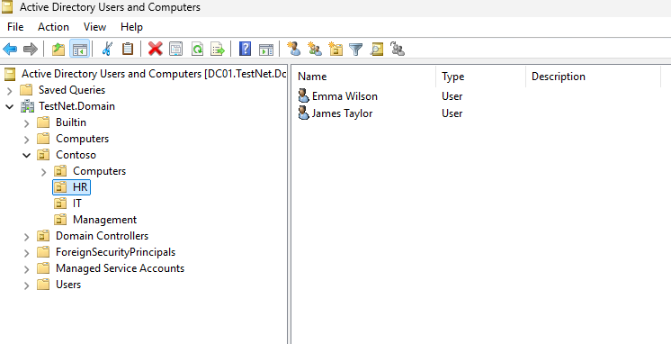
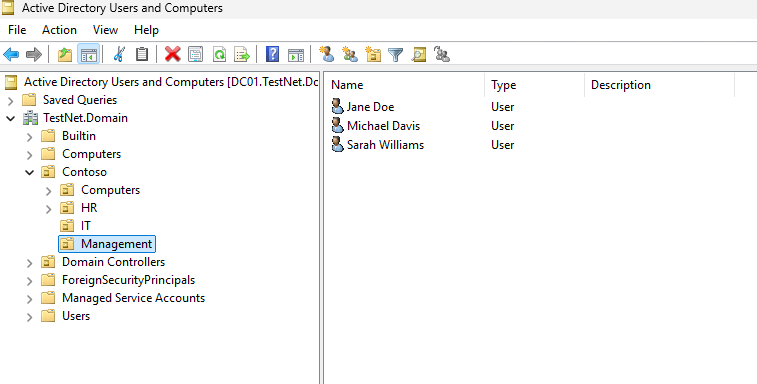
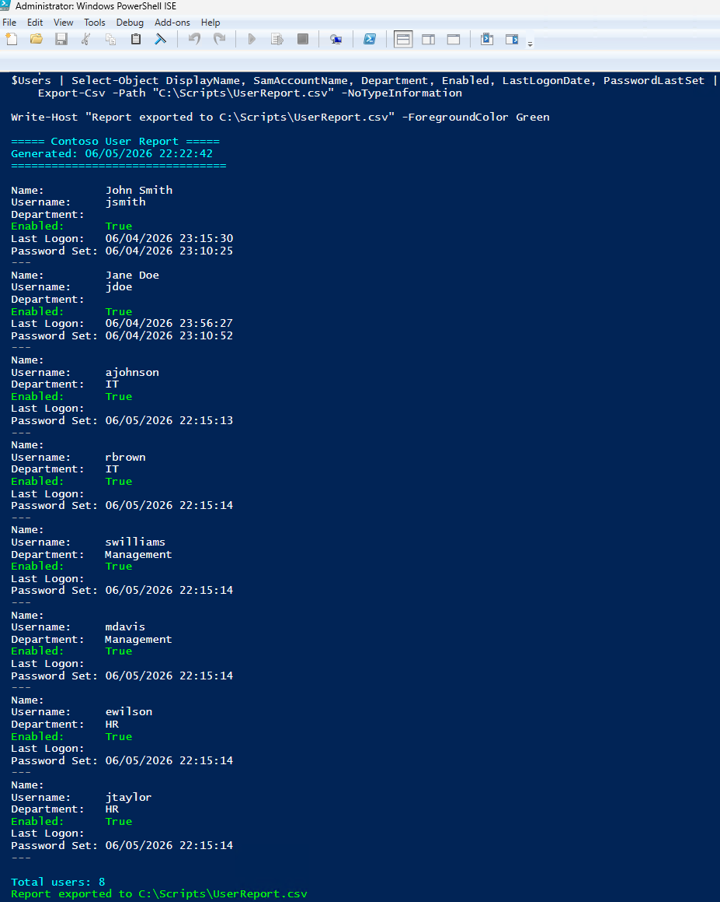
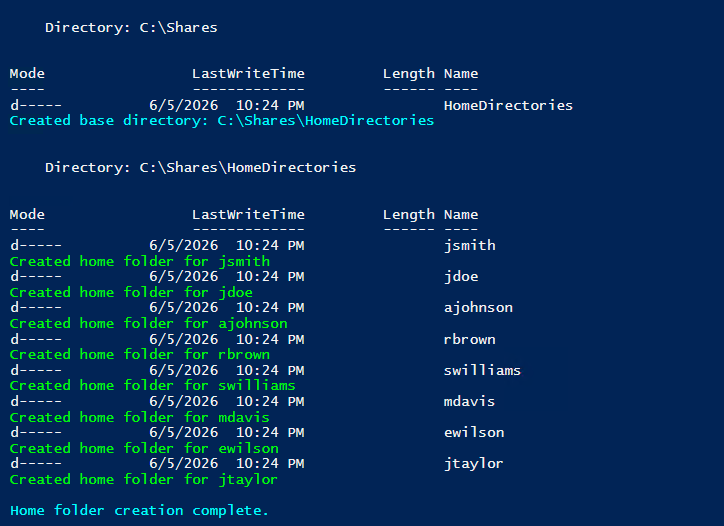
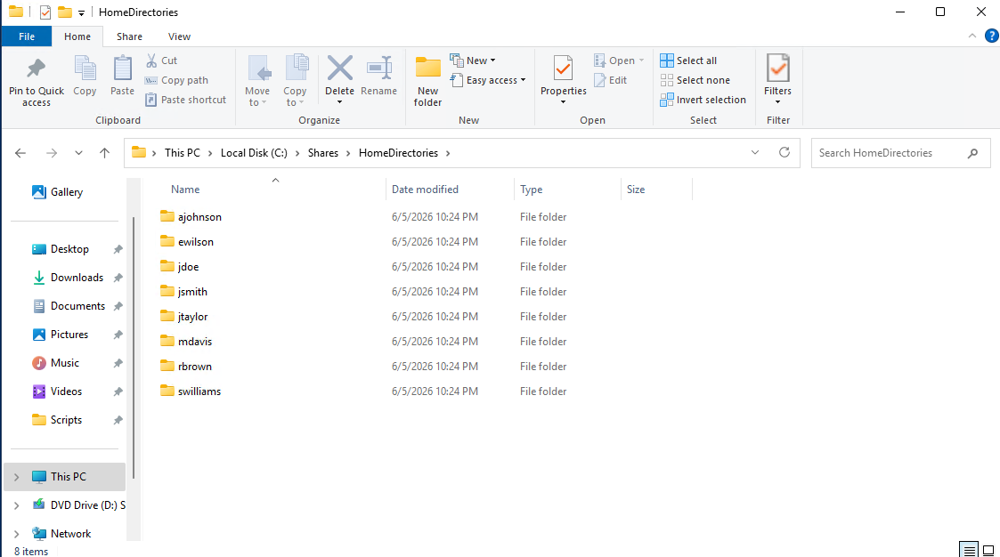

# 08 — PowerShell Automation

This section covers three PowerShell scripts written to automate common IT administration tasks — bulk user creation, AD user reporting, and automated home folder provisioning with NTFS permissions.

---

## New-LabUsers.ps1 — Bulk User Creation

This script reads from a CSV file and creates domain user accounts in bulk, assigning each user to the correct OU based on their department.

### Bulk User Creation

Script running on DC01 — creating all Contoso user accounts from a CSV file in a single execution.

### Users in IT OU

IT department users created by the script, visible in AD Users and Computers inside the IT OU.

### Users in HR OU

HR department users created and placed in the HR OU.

### Users in Management OU

Management department users created and placed in the Management OU.

---

## Get-UserReport.ps1 — AD User Reporting

This script queries Active Directory and exports a report of all domain users including their OU, department, and account status to a CSV file.

### User Report Output

Script output showing the AD user report generated and exported to CSV.

---

## New-UserShare.ps1 — Home Folder Provisioning

This script creates a personal home folder for each user on FS01, sets the NTFS permissions so only that user and Domain Admins have access, and maps the folder path in AD.

### Home Folders Created

Script output showing home folders created for each user on FS01.

### Home Folders in Explorer

Home folder directory on FS01 in File Explorer — one folder per user, confirming the script ran successfully.

---

## Scripts

All scripts are available in the `/scripts` folder of this repository:

- [`New-LabUsers.ps1`](../scripts/New-LabUsers.ps1)
- [`Get-UserReport.ps1`](../scripts/Get-UserReport.ps1)
- [`New-UserShare.ps1`](../scripts/New-UserShare.ps1)

---

## Summary

| Script | Purpose |
|---|---|
| New-LabUsers.ps1 | Bulk user creation from CSV |
| Get-UserReport.ps1 | AD user report exported to CSV |
| New-UserShare.ps1 | Home folder creation with NTFS permissions |

---

[← 07 — pfSense](07-pfsense.md) | [Next: 09 — Backup & DR →](09-backup-dr.md)
