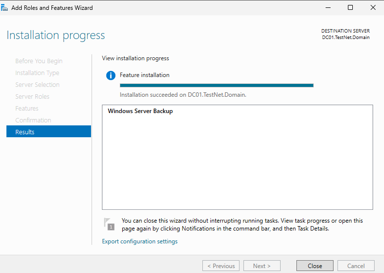
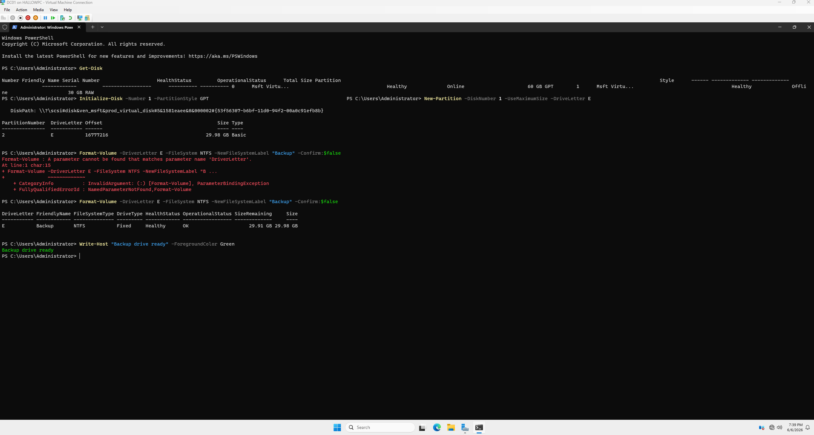
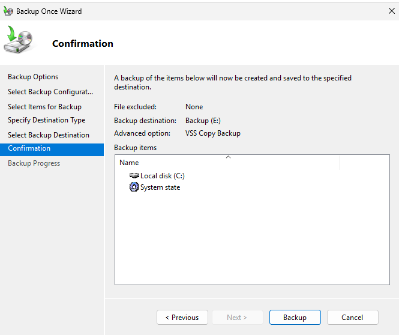
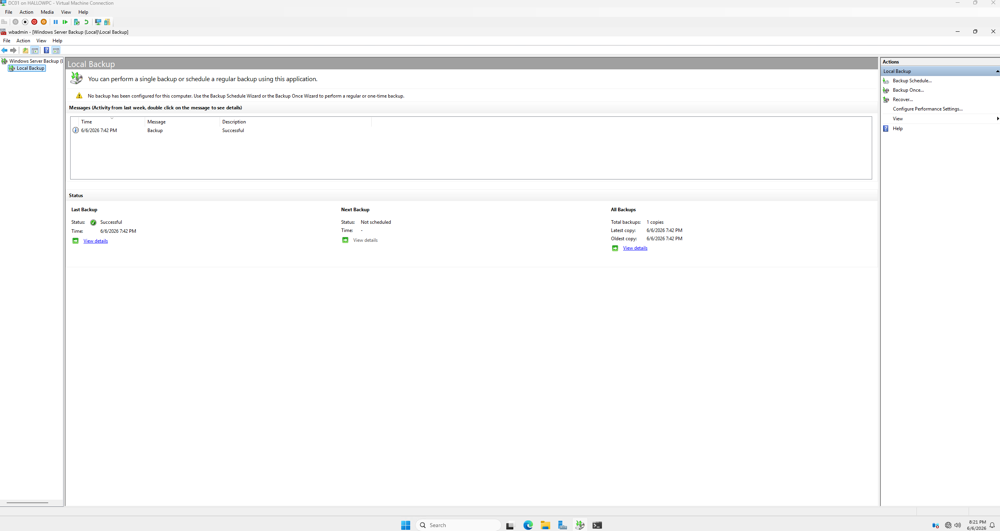
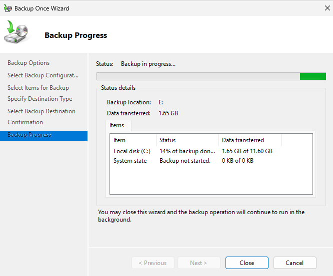
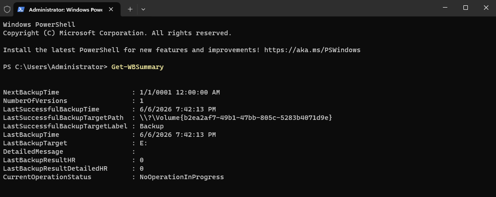
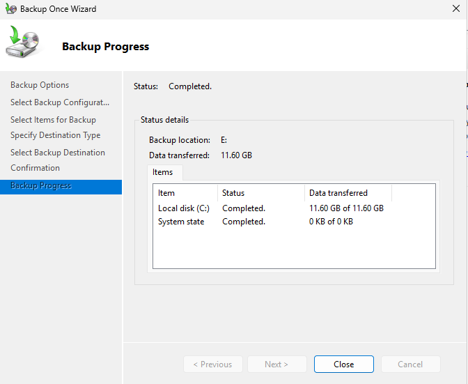

# 09 — Backup & Disaster Recovery

This section covers the setup of Windows Server Backup on DC01, including a dedicated backup volume, full system state backup, and documented DR procedures for common failure scenarios.

---

## Windows Server Backup — Setup

### Backup Feature Installed

Windows Server Backup feature installed on DC01 via Server Manager.

### Backup Drive Setup

Dedicated 30GB backup volume (E: drive) added to DC01 and initialised for use as the backup destination.

---

## Running a Backup

### Backup Confirmation

Backup schedule and destination confirmed before the first backup run — full volume and system state selected.

### Backup WSB

Windows Server Backup console showing the backup job configured and ready to run.

### Backup In Progress

Backup running — system state and full volume being written to the E: backup drive.

### Backup Summary

Backup job summary showing the data transferred, time taken, and backup destination.

### Backup Complete

Backup completed successfully with no errors. Status shown in the Windows Server Backup console.

---

## DR Procedures

The following scenarios are documented as runbooks for common recovery situations in this lab environment.

### DC failure — secondary DC takeover

If DC01 becomes unavailable, DC02 can serve authentication and DNS for the domain. Steps:
1. Verify DC02 is reachable and AD DS service is running
2. Point client DNS to DC02 (`192.168.10.2`) temporarily
3. Seize FSMO roles on DC02 if DC01 will not recover: `ntdsutil` → roles → seize
4. Rebuild DC01 and re-promote once hardware is restored

### Accidental user deletion

1. Open AD Users and Computers → View → Enable Advanced Features
2. Browse to the Deleted Objects container
3. Right-click the deleted user → Restore
4. Verify the account is back in the correct OU and re-enable if needed

### System state restore on DC01

1. Boot DC01 into Directory Services Restore Mode (DSRM) — F8 at boot
2. Open Windows Server Backup → Recover → select the latest backup from E:
3. Choose System State recovery
4. Reboot normally after restore completes

### GPO not applying to clients

1. Run `gpresult /r` on the affected client to see which GPOs are applying
2. Run `gpupdate /force` to force a refresh
3. Check the client is in the correct OU in AD Users and Computers
4. Verify DNS is resolving the domain controller correctly with `nslookup`

---

## Summary

| Component | Detail |
|---|---|
| Backup tool | Windows Server Backup |
| Backup target | DC01 — E: drive (30GB dedicated volume) |
| Backup type | Full volume + system state |
| DR procedures | DC failure, user restore, system state, GPO |

---

[← 08 — PowerShell Automation](08-powershell-automation.md) | [← Back to home](../index.md)
